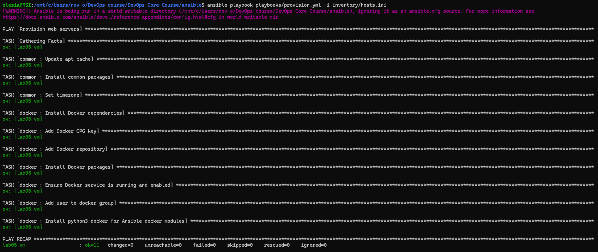
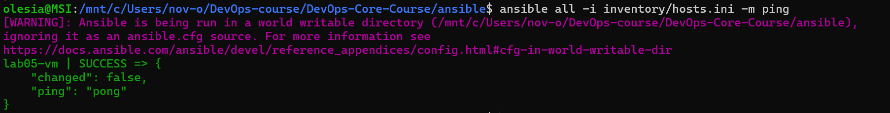
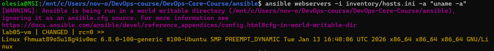
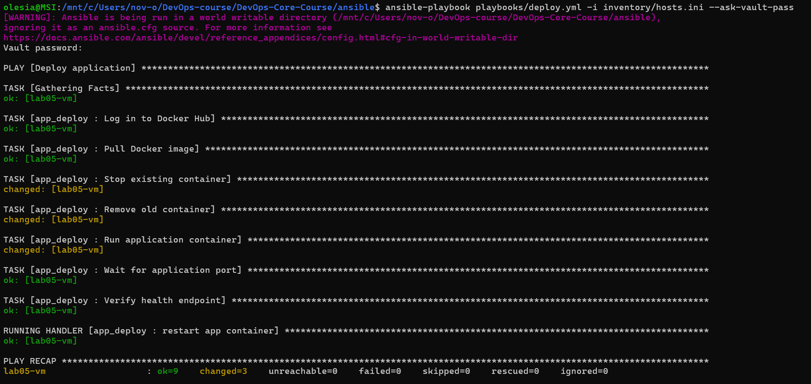
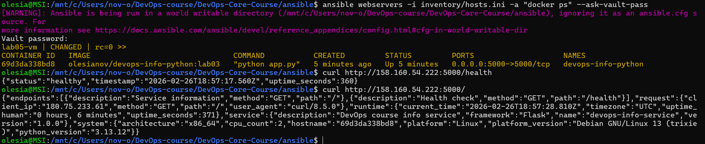
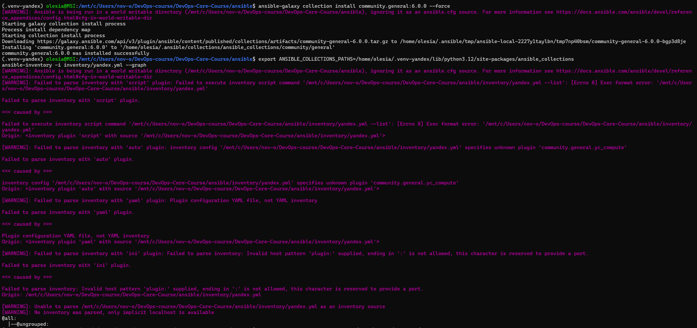

# LAB05 — Ansible Fundamentals

## 1. Architecture Overview

**Ansible version:** core 2.20.3
**Target VM:** Yandex Cloud, Ubuntu 24.04 LTS

**Role structure:**
- **common** — apt update, install base packages, set timezone
- **docker** — add Docker repo, install Docker, add user to docker group
- **app_deploy** — Docker login, pull image, run container, health check

Playbooks call roles, all logic lives in roles, this keeps playbooks short and roles reusable across projects.

## 2. Roles

### common
- **Purpose:** Base setup: apt cache update, install common packages (curl, git, vim, htop, etc.), set timezone.
- **Variables:** `common_packages` (list), `common_timezone` (default UTC).
- **Handlers:** None.
- **Dependencies:** None.

### docker
- **Purpose:** Install Docker (official repo), start and enable service, add user to docker group, install python3-docker for Ansible.
- **Variables:** `docker_user` (default ubuntu), `docker_apt_release` (for repo).
- **Handlers:** `restart docker` — restarted when repo or packages change.
- **Dependencies:** None.

### app_deploy
- **Purpose:** Log in to Docker Hub (vault credentials), pull image, stop/remove old container, run new container, wait for port, check /health.
- **Variables:** From vault: `dockerhub_username`, `dockerhub_password`, `app_name`, `docker_image`, `docker_image_tag`, `app_port`, `app_container_name`. Defaults: `app_port` 5000, `app_restart_policy` unless-stopped.
- **Handlers:** `restart app container` — can be triggered to recreate container.
- **Dependencies:** Needs Docker on host (run docker role before).

## 3. Idempotency Demonstration

**First run:** Some tasks show "changed" (yellow) — apt cache updated, packages installed, Docker installed, user added to group, etc.



**Second run:** Tasks show "ok" (green), 0 changed. Desired state is already there, so Ansible does nothing.

**What changed first time:** Apt cache update, package installs, Docker repo and packages, service start, user group. All use stateful modules (`apt`, `service`, `user`) so second run only checks state and reports ok.

**What makes roles idempotent:** Using `state: present`, `cache_valid_time` so apt is not updated every time, and handlers only when config changes.

## 4. Ansible Vault Usage

Credentials are stored in **`inventory/group_vars/all.yml`** (encrypted with Ansible Vault). With `-i inventory/hosts.ini`, Ansible loads group_vars from the inventory directory, so the vault must be there. Create it with:

```bash
ansible-vault create inventory/group_vars/all.yml
```

Add Docker Hub username, token (PAT), and app name/image/tag. Never commit the vault password; use `--ask-vault-pass` or a password file and add `.vault_pass` to `.gitignore`.

**Why Vault:** So secrets are not in plain text in the repo. Encrypted file can be committed; only the password is secret.

## 5. Deployment Verification

**Connectivity:** `ansible all -i inventory/hosts.ini -m ping` and `ansible webservers -i inventory/hosts.ini -a "uname -a"`





**deploy.yml run:**



**Container status:** `ansible webservers -i inventory/hosts.ini -a "docker ps" --ask-vault-pass`

**Health check:** `curl http://<VM-IP>:5000/health` and `curl http://<VM-IP>:5000/`



**Handler:** Restart app container runs only when the "Run application container" task reports changed (e.g. image or config change).

## 6. Key Decisions

- **Why roles instead of plain playbooks?** Roles are reusable and keep tasks grouped by concern. Playbooks stay short and readable.
- **How do roles improve reusability?** The same role can be included in several playbooks or projects. Variables and defaults make one role work in different environments.
- **What makes a task idempotent?** Using modules that describe desired state (e.g. `apt` with `state: present`, `service` with `state: started`) so Ansible only changes something when the current state differs.
- **How do handlers improve efficiency?** Handlers run once at the end of the play when notified, so multiple changes to the same service cause one restart instead of many.
- **Why is Ansible Vault necessary?** To store secrets (e.g. Docker Hub token) in the repo without exposing them in plain text.

## 7. Challenges

- **World-writable directory:** Running from `/mnt/c/...` (Windows mount in WSL) makes Ansible ignore `ansible.cfg`. Fix: always pass `-i inventory/hosts.ini` and set `ANSIBLE_ROLES_PATH` when running playbooks.
- **SSH key path:** From WSL, use the key in the Linux filesystem (e.g. `/home/user/.ssh/id_rsa`) in `hosts.ini`; keys on the Windows mount can have permissions SSH rejects.

---

## Bonus — Dynamic Inventory (Yandex Cloud)

**Configured:** `inventory/yandex.yml` is set up for Yandex Cloud dynamic inventory (plugin `community.general.yc_compute`, OAuth via `YC_TOKEN`, folder via `YC_FOLDER_ID`, `compose` for `ansible_host` and `ansible_user`).

**Outcome:** The plugin `community.general.yc_compute` was not present in `community.general` 6.0.0 or 12.4.0 in this environment; the `yandex.cloud` collection could not be installed (dependency conflict). Static inventory `inventory/hosts.ini` was used for the lab.



**If the plugin were available:** Run with `YC_TOKEN` and `YC_FOLDER_ID` set, then `ansible-inventory -i inventory/yandex.yml --graph` to see VMs; playbooks would use `-i inventory/yandex.yml`. When the VM IP changes, no manual update — the API returns current IPs.

**Benefits of dynamic inventory:** No hardcoded IPs; one config for many VMs; new VMs appear automatically.