# LAB06 — Advanced Ansible & CI/CD

**CI/CD logs:** Full workflow run logs are attached in `ansible/docs/` as a `.zip` file for evidence.

## 1. Overview

**Technologies:** Ansible 2.16+, Docker Compose v2, `community.docker.docker_compose_v2`, GitHub Actions.

**Accomplished:** Refactored **common** and **docker** roles with blocks, rescue/always, and tags. Replaced **app_deploy** with **web_app** role using Docker Compose (templated `docker-compose.yml.j2`). Implemented **wipe logic** (variable `web_app_wipe` + tag `web_app_wipe`). Added CI/CD workflow (ansible-lint, deploy, verify on port 5000). Bonus: multi-app vars/playbooks and separate workflow for bonus app.

## 2. Blocks & Tags

**common role:** Block 1 (tag `packages`): apt update, install packages, timezone — rescue: apt-get update --fix-missing; always: log to `/tmp/ansible-common-complete.log`. Block 2 (tag `users`): ensure deploy user exists.

**docker role:** Block 1 (tag `docker_install`): install Docker — rescue: pause 10s and retry GPG key; always: ensure Docker service enabled. Block 2 (tag `docker_config`): add user to docker group, install python3-docker.

**Tag strategy:** `common`, `packages`, `users`, `docker`, `docker_install`, `docker_config`, `app_deploy`, `compose`, `web_app_wipe`.

**Evidence:**

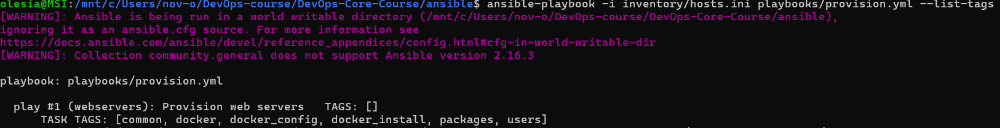

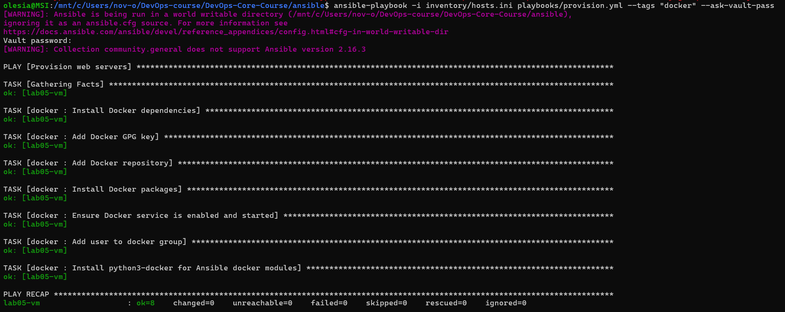

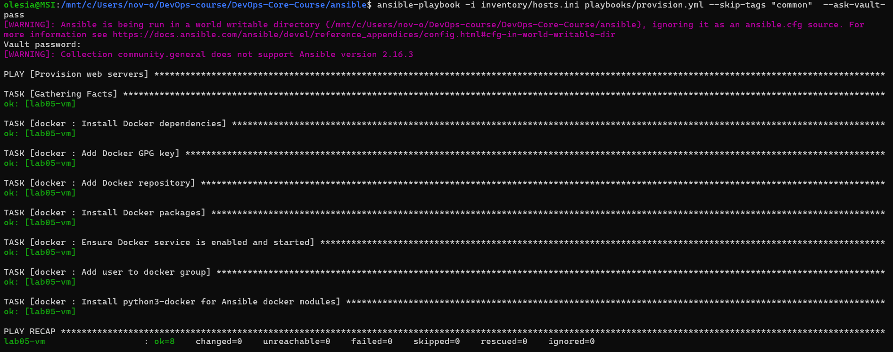

## 3. Docker Compose Migration

**Template:** `roles/web_app/templates/docker-compose.yml.j2` — variables: `app_name`, `docker_image`, `docker_image_tag`/`docker_tag`, `app_port`, `app_internal_port`, `app_env`, optional `app_secret_key`. Restart: `unless-stopped`.

**Role dependencies:** `roles/web_app/meta/main.yml` declares dependency on **docker** so Docker is installed before app deploy.

**Before:** app_deploy used `docker_container` (docker run). **After:** web_app uses `docker_compose_v2` with templated compose file in `compose_project_dir`.

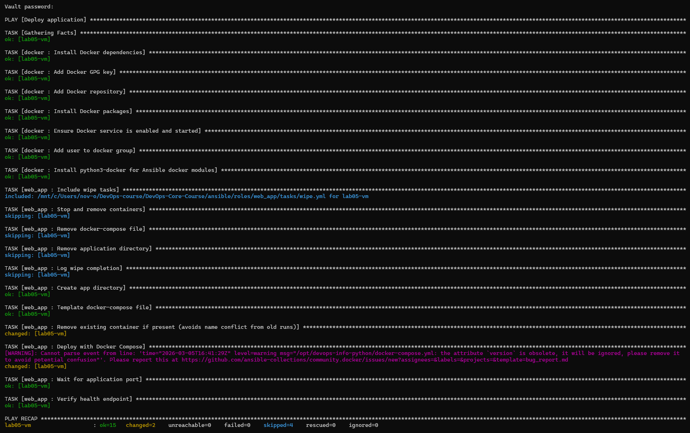

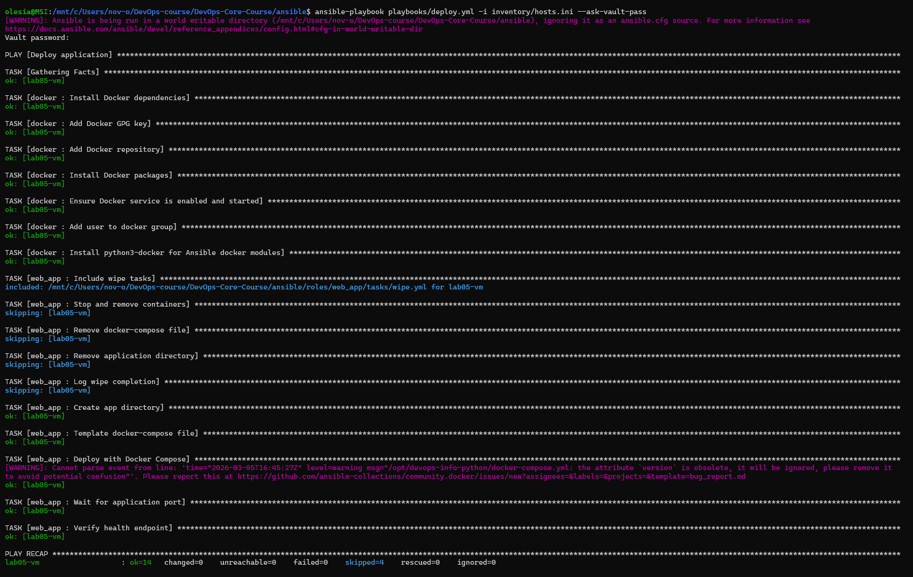

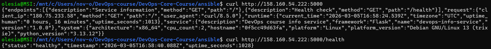

## 4. Wipe Logic

**Implementation:** `roles/web_app/tasks/wipe.yml` — stat for project dir, compose down (when dir exists), remove compose file, remove app dir, debug log. Included at top of `main.yml`. Runs only when `web_app_wipe | default(false) | bool` and tag `web_app_wipe` is used (or full play with variable set).

**Scenarios:** (1) Normal deploy — wipe skipped. (2) Wipe only: `-e "web_app_wipe=true" --tags web_app_wipe`. (3) Clean reinstall: `-e "web_app_wipe=true"` (wipe then deploy). (4a) Tag without variable — wipe skipped by `when`.

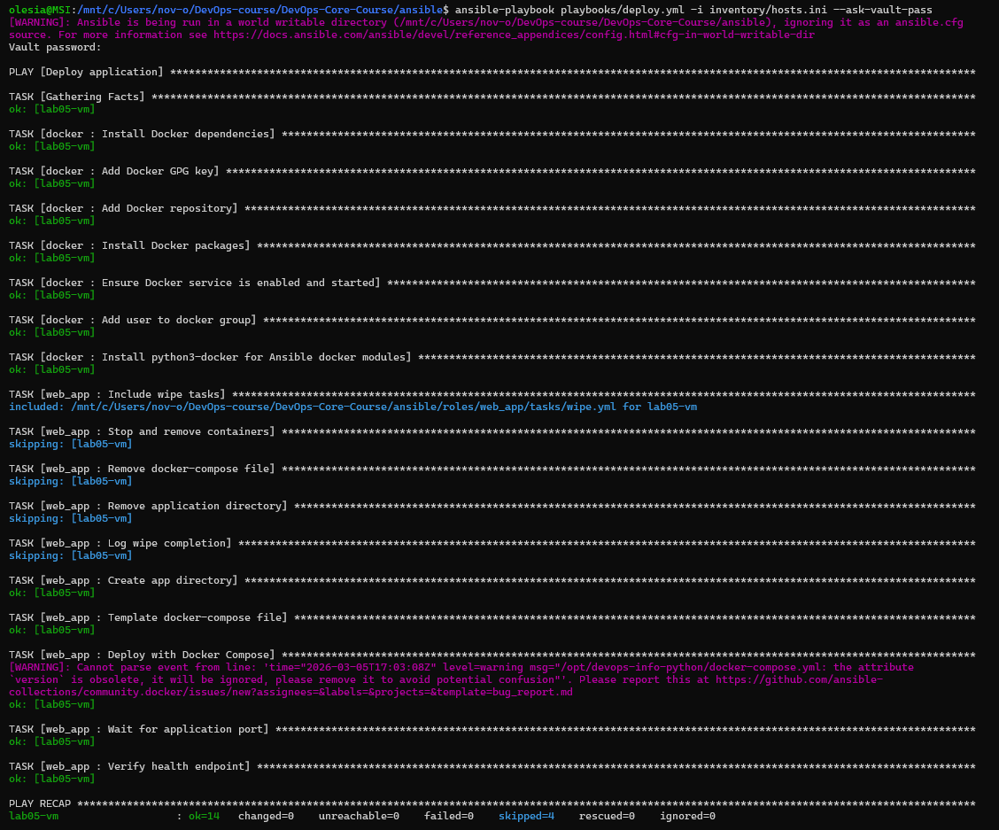

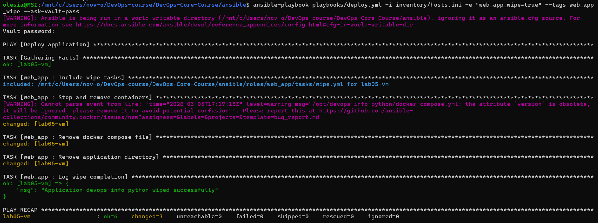

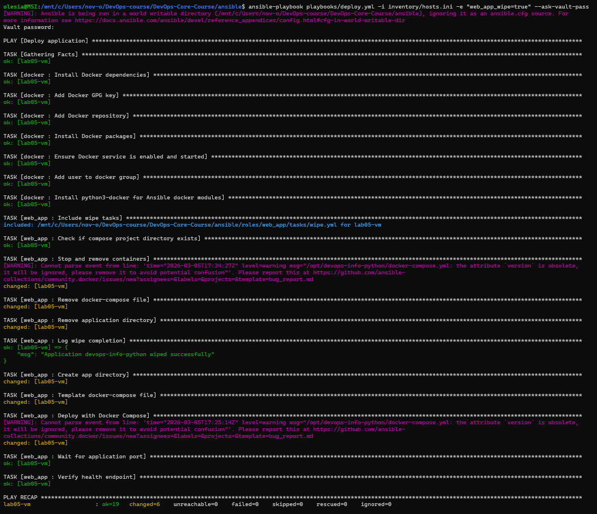

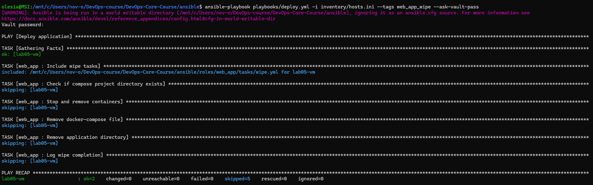

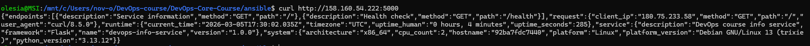

## 5. CI/CD Integration

**Workflow:** `.github/workflows/ansible-deploy.yml`. Triggers: push/PR with changes in `ansible/**` or workflow file; also `workflow_dispatch`. Jobs: **lint** (ansible-lint with profile min), **deploy** (SSH key from secret, vault, playbook with `-e ansible_ssh_private_key_file=$HOME/.ssh/id_rsa`, curl verification on port 5000 and `/health`).

**Secrets:** `ANSIBLE_VAULT_PASSWORD`, `SSH_PRIVATE_KEY`, `VM_HOST`. Verification uses port 5000 (match `app_port` in vault).

**CI/CD logs:** A full workflow run log is attached in `ansible/docs/` as a zip file (e.g. `logs_59527451210.zip`) for evidence.

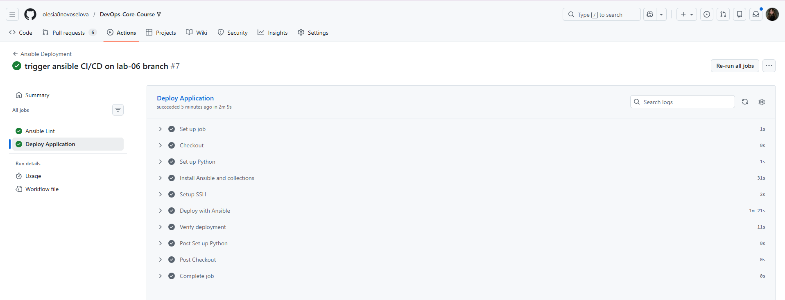

## 6. Testing Results

**Tags:** `--list-tags` shows all tags; runs with `--tags`/`--skip-tags` execute only selected tasks.

**Idempotency:** Second run of `deploy.yml` shows ok, no changes.

**Wipe:** All four scenarios (normal, wipe-only, clean reinstall, tag-only) produce expected behaviour.

**Application:** `curl http://<VM_IP>:5000` and `curl http://<VM_IP>:5000/health` return success after deploy (app_port in vault is 5000).

## 7. Challenges & Solutions

- **Compose module:** Used `community.docker.docker_compose_v2` (Compose v2) instead of deprecated `docker_compose`.
- **Group vars:** Use `inventory/group_vars/all.yml` (vault) when running with `-i inventory/hosts.ini`; ensure `docker_image_tag` or `docker_tag` and `app_port` match your app.
- **CI SSH key path:** Inventory had `/home/olesia/.ssh/id_rsa`; workflow overrides with `-e ansible_ssh_private_key_file=$HOME/.ssh/id_rsa` on the runner.
- **CI verify port:** Workflow verifies on port 5000 to match vault `app_port`.

## 8. Research Answers

**Task 1:** If rescue block fails, the play fails. Nested blocks are allowed. Tags on a block apply to all tasks inside it.

**Task 3:** Variable + tag give double safety (default off + explicit tag). `never` tag excludes tasks; here we use a positive tag + `when`. Wipe before deploy allows one play to do clean reinstall. Clean reinstall for major/broken state; rolling update for zero-downtime. To wipe images/volumes: add tasks or compose `state: absent` with options, same variable/tag.

**Task 4:** SSH keys in Secrets are encrypted at rest; use deploy keys and rotate if leaked. Staging -> production: separate workflows or environments with different inventories. Rollbacks: playbook with previous image tag or wipe + deploy old tag. Self-hosted runner avoids exposing SSH to GitHub-hosted runners.

---

## Bonus Part 1 — Multi-App

**Vars:** `vars/app_python.yml`, `vars/app_bonus.yml`. **Playbooks:** `deploy_python.yml`, `deploy_bonus.yml`, `deploy_all.yml`. In `deploy_all.yml`: Python app on host port **8000** (image `devops-info-python:lab03`), Go app on **8001** (image `devops-info-go:lab03`). Wipe is per-app via different `app_name`/`compose_project_dir`. Role reusability: same `web_app` role with different vars.

**Evidence:** Both apps deployed; `docker ps` shows `devops-python` and `devops-go`; curl to :8000 and :8001 succeed.

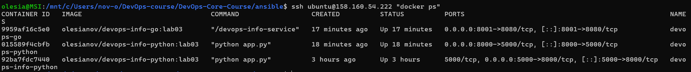

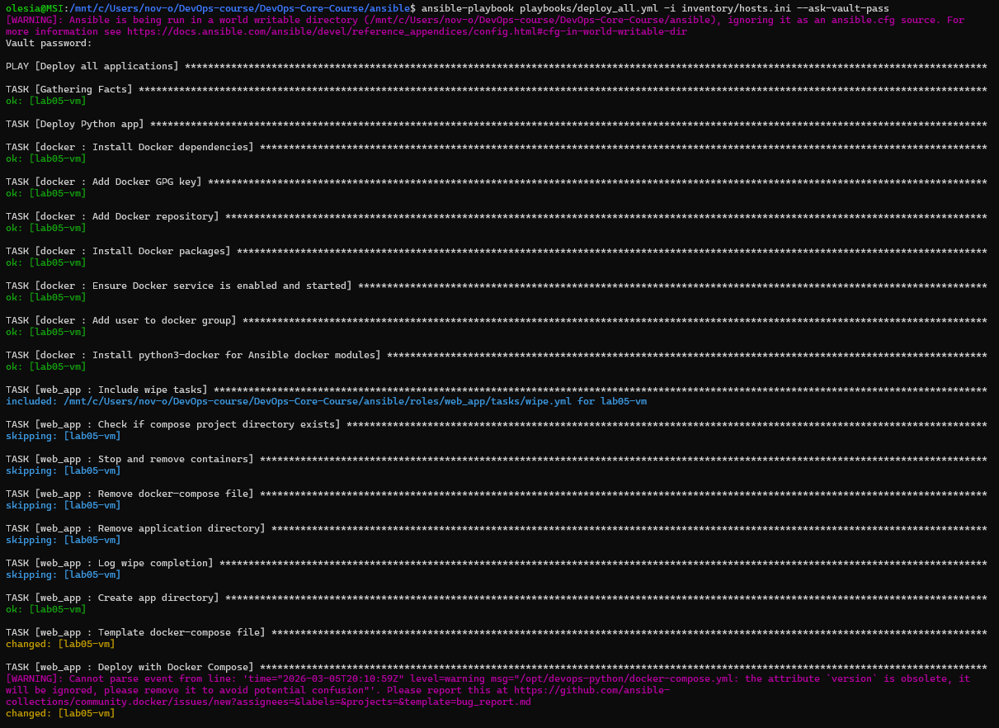

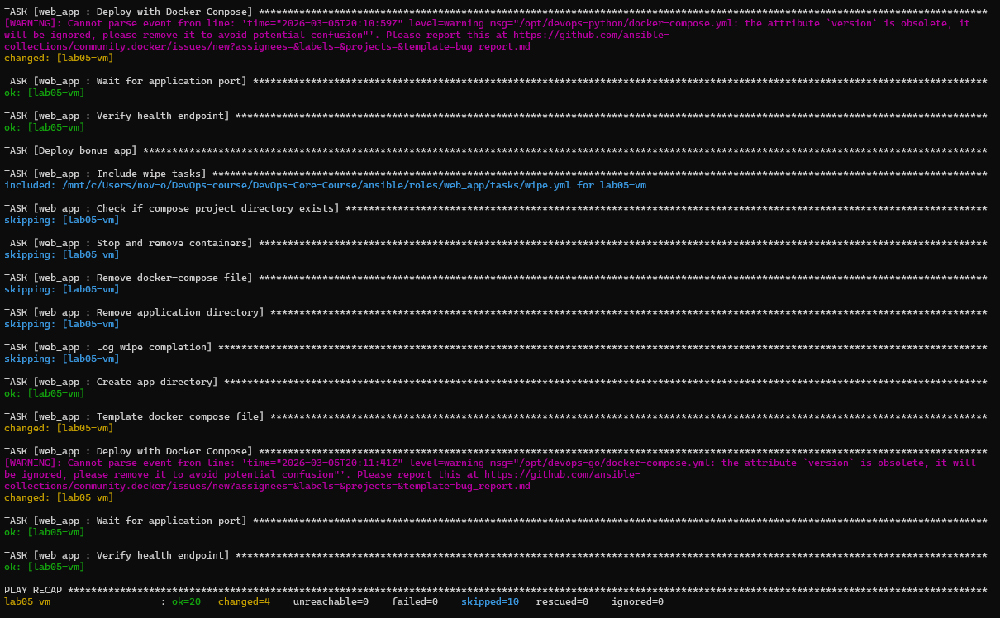

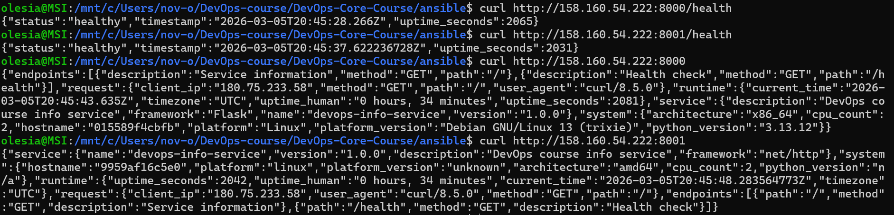
---

## Bonus Part 2 — Multi-App CI/CD

**Workflow:** `.github/workflows/ansible-deploy-bonus.yml` — separate pipeline for the bonus app only (Go on port 8001). Independent from the main `ansible-deploy.yml` (Python on 5000).

**Triggers:**
- **Push** when only these paths change: `ansible/vars/app_bonus.yml`, `ansible/playbooks/deploy_bonus.yml`, `ansible/roles/web_app/**`, or the workflow file. Other changes under `ansible/**` trigger only the main workflow.
- **workflow_dispatch** — manual run from Actions -> Ansible Deploy Bonus -> Run workflow.

**Jobs:** (1) **Ansible Lint** — runs on `deploy_bonus.yml` and `deploy_all.yml`. (2) **Deploy Bonus Application** — installs Ansible, writes SSH key to `~/.ssh/id_rsa`, runs `playbooks/deploy_bonus.yml` with vault and `-e ansible_ssh_private_key_file=$HOME/.ssh/id_rsa`, then **Verify bonus app** — `curl` to `VM_HOST:8001` and `VM_HOST:8001/health`.

**Secrets:** same as main workflow — `ANSIBLE_VAULT_PASSWORD`, `SSH_PRIVATE_KEY`, `VM_HOST`. Ports 8000 and 8001 must be open in the VM’s security group for CI and local curl.

**Evidence:** 

