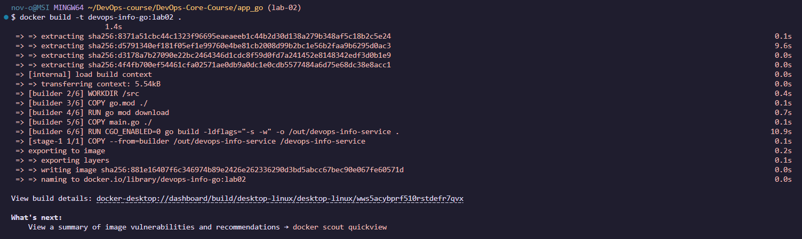
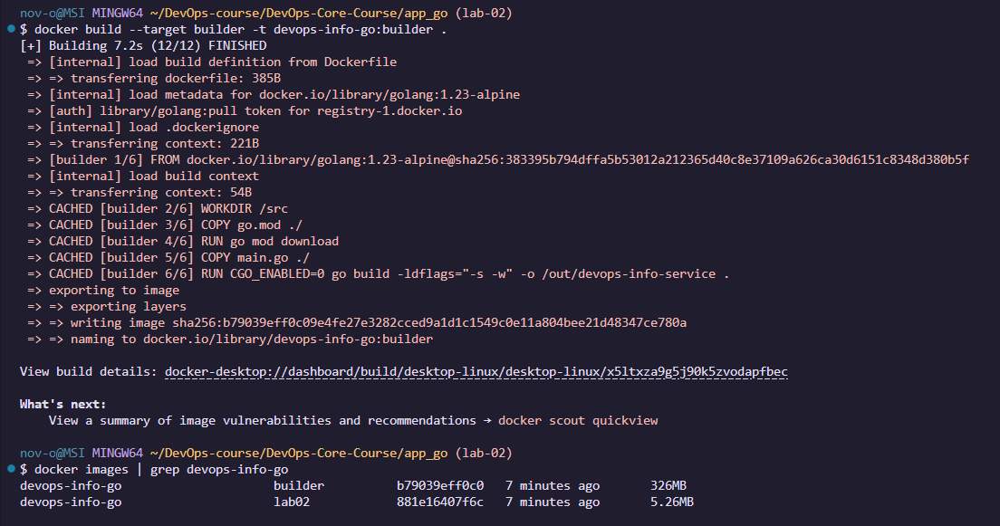
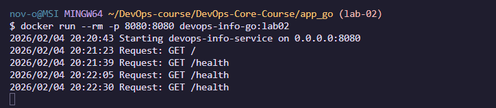
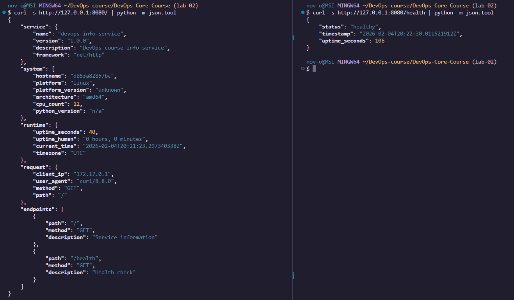

# LAB02 — Multi-Stage Docker Build (Go Bonus)

## Multi-stage build strategy
I used two stages: **builder** (compiles the Go app) and **runtime** (runs only the compiled binary).  
This keeps the final image small because it contains no Go toolchain or build utilities.

## Technical explanation of each stage

### Stage 1 — Builder
- Base: `golang:1.23-alpine` (has Go compiler)
- Downloads modules and builds a **static** binary (`CGO_ENABLED=0`)
- Uses `-ldflags="-s -w"` to reduce binary size

Snippet:
```dockerfile
FROM golang:1.23-alpine AS builder
RUN CGO_ENABLED=0 go build -ldflags="-s -w" -o /out/devops-info-service .
```

### Stage 2 — Runtime

* Base: `scratch` (empty minimal image)
* Copies only the binary from the builder stage
* Runs as non-root user (`USER 65532:65532`)

Snippet:

```dockerfile
FROM scratch
USER 65532:65532
COPY --from=builder /out/devops-info-service /devops-info-service
```

## Build process + image sizes (builder vs final)

### Build final image

```bash
cd app_go
docker build -t devops-info-go:lab02 .
```




### Build builder stage

```bash
docker build --target builder -t devops-info-go:builder .
```

#### Compare image sizes

```bash
docker images | grep devops-info-go
```



The multi-stage build works as intended: the builder image is 326MB, while the final runtime image is only 5.26MB, showing a major size reduction by shipping only the compiled binary.


## Run + test endpoints

Run container:

```bash
docker run --rm -p 8080:8080 devops-info-go:lab02
```




Test (new terminal):

```bash
curl -s http://127.0.0.1:8080/ | python -m json.tool
curl -s http://127.0.0.1:8080/health | python -m json.tool
```




## Why multi-stage builds matter (compiled languages)

The builder image contains compilers and build tools, which makes it much bigger.
With multi-stage builds, the final image ships only the binary, so it is smaller, faster to pull, and easier to secure.

## Security implications

* Final image uses `scratch`, so there is no shell or package manager (smaller attack surface).
* The container runs as a non-root user (`USER 65532:65532`), reducing the impact of potential vulnerabilities.

## Decisions

* `scratch` is minimal and secure, but debugging inside the container is harder (no shell).
* I built a static binary (`CGO_ENABLED=0`) so it runs reliably in `scratch`.

## Challenges & Solutions

**Challenge:** Running the app in `scratch` requires a static binary.
**Solution:** I set `CGO_ENABLED=0` and copied only the compiled binary into the runtime stage.