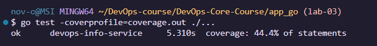

# LAB03 — Continuous Integration (CI/CD) (Go)

## Overview
Go CI uses GitHub Actions to format-check, vet, test, and build/push the Docker image.  
The workflow runs only when `app_go/**` changes (path filters).

**Versioning:** CalVer (YYYY.MM.DD) + `latest` (and an extra tag with short commit SHA).  
**Coverage:** Go uses built-in coverage output (`coverage.out`) uploaded to Codecov.

## Tests + Coverage
### Test structure
Tests are in `app_go/main_test.go`.  
They call handlers using `httptest` and validate status codes and basic JSON fields.

### Run tests locally
```bash
cd app_go
gofmt -w .
go vet ./...
go test -coverprofile=coverage.out ./...
```



## Workflow Evidence

* Go workflow run:  https://github.com/olesia8novoselova/DevOps-Core-Course/actions/runs/21953824897
* Docker Hub Go image:  https://hub.docker.com/repository/docker/olesianov/devops-info-go/general

## Path Filters (Monorepo benefit)

Path filters avoid running Go CI when only Python changes, which saves CI time and reduces noise.
If both apps change in one commit, both workflows run in parallel.

## CI Best Practices Applied

* **Format check:** fails if `gofmt` is needed.
* **Static analysis:** `go vet` catches common mistakes.
* **Job dependency:** Docker push runs only after tests pass.
* **Conditional push:** images push only on `master`.
* **Caching:** `actions/setup-go` caching speeds up repeated runs.
* **Concurrency:** cancels outdated runs on new commits.

## Challenges

* CI failed when `gofmt` was required for `main_test.go`.
  Fix: run `gofmt -w .` and commit the formatted file.
