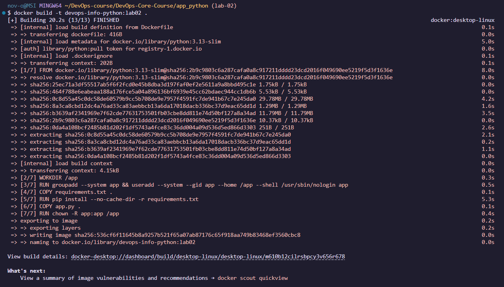
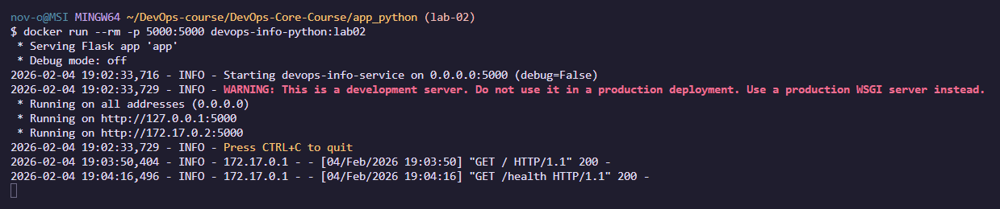
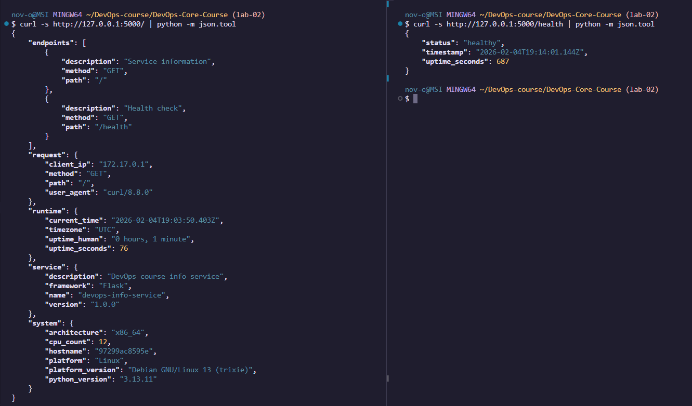
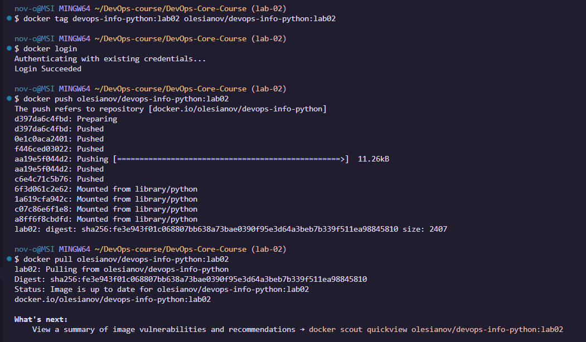

# LAB02 — Docker Containerization (Python)

## Docker Best Practices Applied
1. **Specific base image** (`python:3.13-slim`): stable and smaller than full images.
2. **Non-root user** (`USER app`): safer, reduces risk if the container is compromised.
3. **Layer caching**: copy `requirements.txt` first, install deps, then copy code (faster rebuilds).
4. **Only needed files**: copy only `requirements.txt` and `app.py`.
5. **.dockerignore**: reduces build context size (faster build, less junk in image).
6. **No pip cache**: `pip install --no-cache-dir` keeps image smaller.

Dockerfile snippet (non-root):
```dockerfile
RUN groupadd --system app && useradd --system --gid app --home /app --shell /usr/sbin/nologin app
USER app
```

## Image Information & Decisions

**Base image:** `python:3.13-slim`
**Why:** small, official, and enough for Flask.

**Layer structure:**

* install dependencies first (cached)
* copy application code last (changes often)

**Final image size:**

```bash
docker images | grep devops-info-python
```

Output:

```txt
devops-info-python                 lab02            536cf6f11645   28 minutes ago   122MB
```

## Build & Run Process

### Build

```bash
cd app_python
docker build -t devops-info-python:lab02 .
```



### Run

```bash
docker run --rm -p 5000:5000 devops-info-python:lab02
```


### Test endpoints (from another terminal)

```bash
curl -s http://127.0.0.1:5000/ | python -m json.tool
curl -s http://127.0.0.1:5000/health | python -m json.tool
```



### Docker Hub

Tag strategy: `<dockerhub-username>/devops-info-python:lab02` (username + app name + lab tag).

Terminal output showing successful push:



Docker Hub repository URL:

```txt
https://hub.docker.com/repository/docker/olesianov/devops-info-python/general
```

## Technical Analysis

* **Why this Dockerfile works:** it installs dependencies, copies the app, runs it as non-root, and exposes the app port.
* **If layer order changes:** copying all files before installing deps would break caching (slower rebuilds).
* **Security considerations:** non-root user and slim base image reduce attack surface.
* **How .dockerignore helps:** smaller build context -> faster builds and fewer unwanted files in the image.

## Challenges & Solutions

**Challenge:** Understanding why Docker layer ordering matters.
**Solution:** I copied `requirements.txt` first so dependency installation is cached, then copied the app code last.