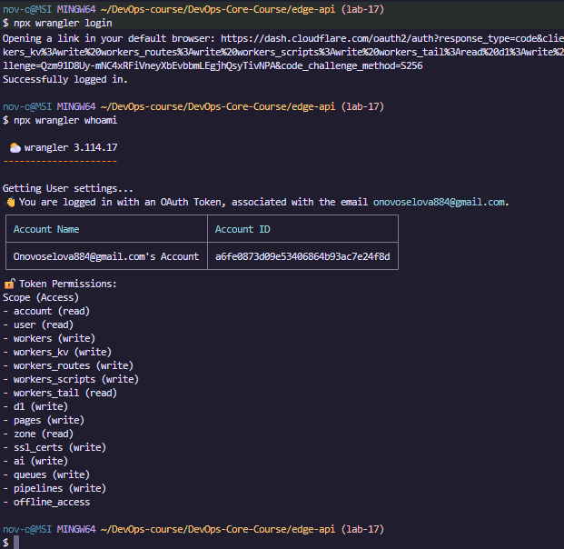
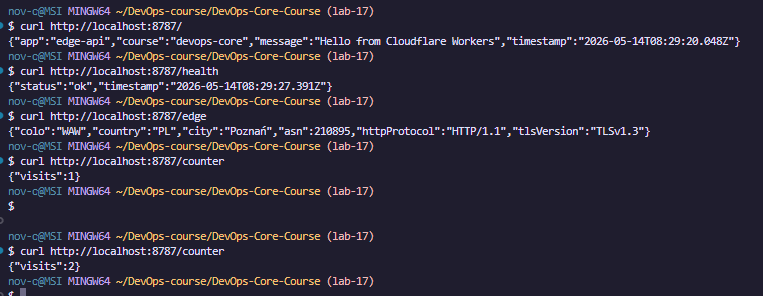
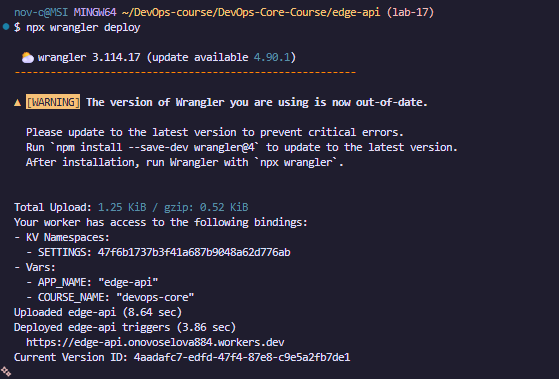
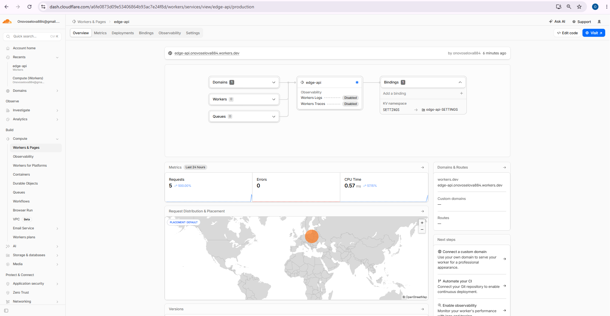
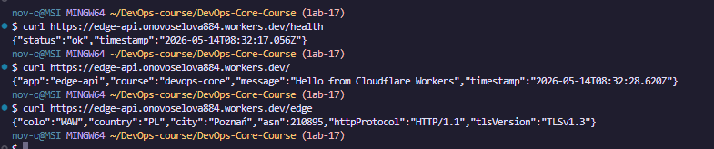
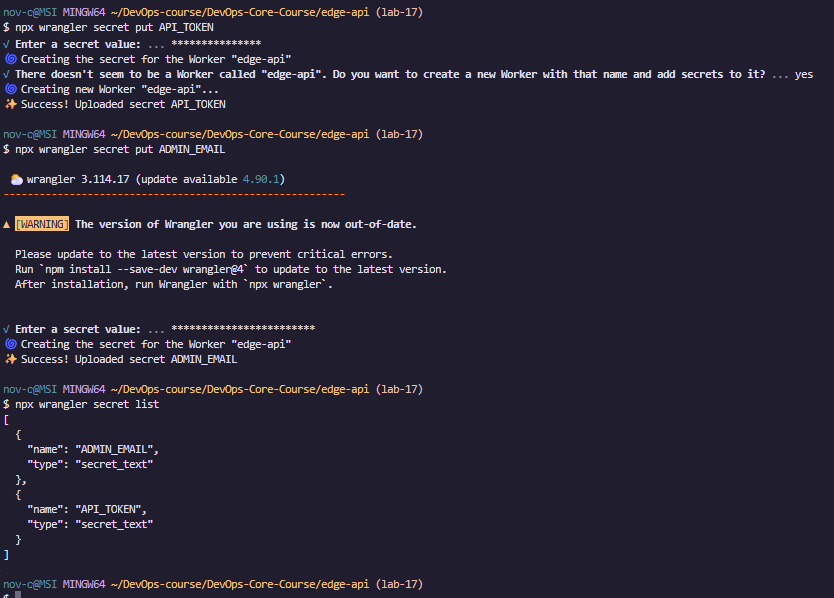
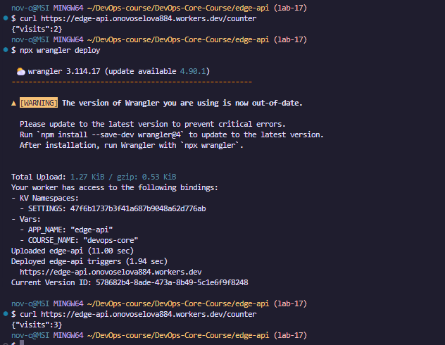
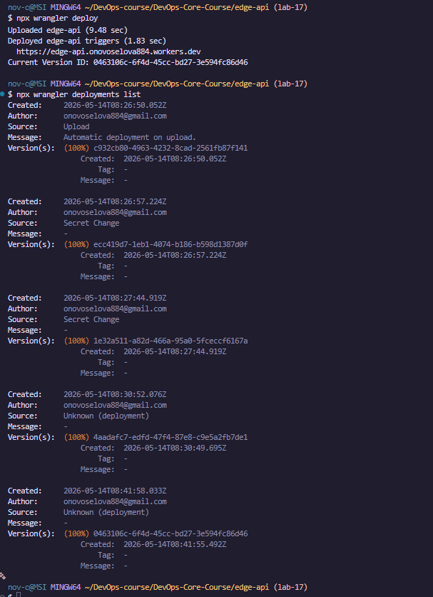
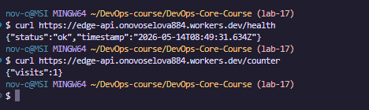
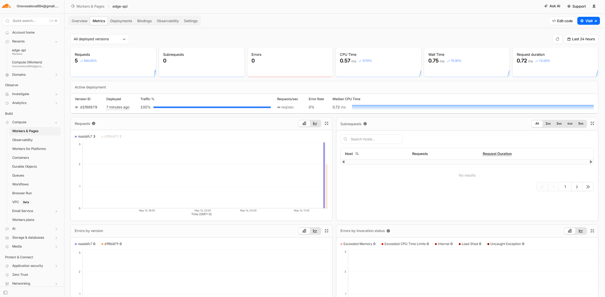

# WORKERS.md — Cloudflare Workers Deployment

## 1. Deployment Summary

**Worker name:** `edge-api`

**Public URL:** `https://edge-api.onovoselova884.workers.dev`

### Routes

| Path | Description |
|------|-------------|
| `GET /` | App info: name, course, timestamp |
| `GET /health` | Health check, returns `{ status: "ok" }` |
| `GET /edge` | Edge metadata: colo, country, city, ASN, HTTP protocol, TLS version |
| `GET /counter` | KV-backed visit counter, persists across requests and redeploys |

### Configuration

- Plaintext vars: `APP_NAME`, `COURSE_NAME` defined in `wrangler.jsonc`
- Secrets: `API_TOKEN`, `ADMIN_EMAIL` set via Wrangler CLI (not in Git)
- KV namespace: `SETTINGS` bound for persistent counter storage

---

## 2. Evidence

### Setup — Wrangler authentication



### Local development



### Deployment



### Cloudflare Dashboard



### /edge JSON Response

```json
$ curl https://edge-api.onovoselova884.workers.dev/edge
{"colo":"WAW","country":"PL","city":"Poznań","asn":210895,"httpProtocol":"HTTP/1.1","tlsVersion":"TLSv1.3"}
```



### Secrets



### KV counter persistence after redeploy



### Deployment history



### Tail logs



### Metrics



---

## 3. Kubernetes vs Cloudflare Workers Comparison

| Aspect | Kubernetes | Cloudflare Workers |
|--------|------------|--------------------|
| Setup complexity | High — cluster provisioning, node pools, namespaces, RBAC | Low — one CLI command, no infrastructure to manage |
| Deployment speed | Minutes (image build, push, rolling update) | Seconds (Wrangler uploads and propagates globally) |
| Global distribution | Manual — requires multi-region clusters or federation | Automatic — code runs in 300+ data centers by default |
| Cost (for small apps) | Moderate to high — cluster nodes run 24/7 | Free tier covers 100,000 requests/day; pay-per-request after |
| State/persistence model | Volumes, StatefulSets, PVCs, external databases | Workers KV (eventually consistent), Durable Objects (strongly consistent), D1 (SQL) |
| Control/flexibility | Full — any runtime, OS, networking, long-running processes | Limited — V8 isolate model, max 30s CPU, no TCP sockets |
| Best use case | Long-running services, stateful workloads, complex microservice meshes | Lightweight HTTP APIs, edge logic, request transformation, global low-latency endpoints |

---

## 4. When to Use Each

**Kubernetes is the better choice when:**
- The workload is stateful and requires persistent volumes or databases co-located with the app.
- The runtime needs are outside what a V8 isolate can provide (native binaries, GPU, long-running background threads).
- The team already manages a cluster and needs fine-grained network policies or custom admission webhooks.
- Processing time per request regularly exceeds a few seconds.

**Cloudflare Workers is the better choice when:**
- The goal is a lightweight public API or webhook handler that needs to be globally fast.
- There is no budget or staff for infrastructure management.
- Deployment simplicity and speed matter more than runtime flexibility.
- The app is stateless or can use KV/Durable Objects for its limited state needs.

---

## 5. Reflection

**What felt easier than Kubernetes:**
Deployment is a single command and takes a few seconds. There are no pods, deployments, services, or ingress objects to manage. Secrets and environment variables are handled by the platform without needing Kubernetes Secrets or Vault. The public URL is available immediately after the first deploy.

**What felt more constrained:**
The V8 isolate model means no access to the filesystem, no raw TCP connections, limited CPU time per request, and no support for arbitrary native packages. State management requires using platform-specific primitives (KV, Durable Objects, D1) rather than a standard database or filesystem. Workers KV is eventually consistent, which is not suitable for all workloads.

**What changed because Workers is not a Docker host:**
There is no Docker image, no container build step, and no registry involved. The application is a JavaScript/TypeScript module bundled and uploaded directly by Wrangler. The compute model is per-request isolation in a V8 isolate rather than a long-running process. This means no in-memory state between requests (unless using Durable Objects), and no background tasks.