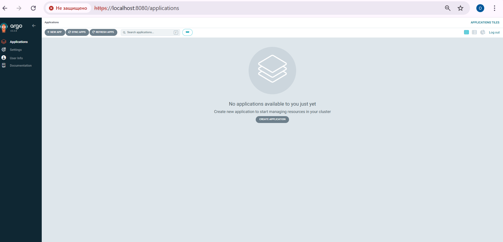
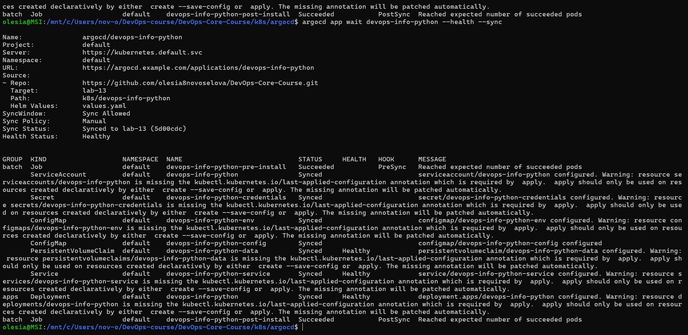
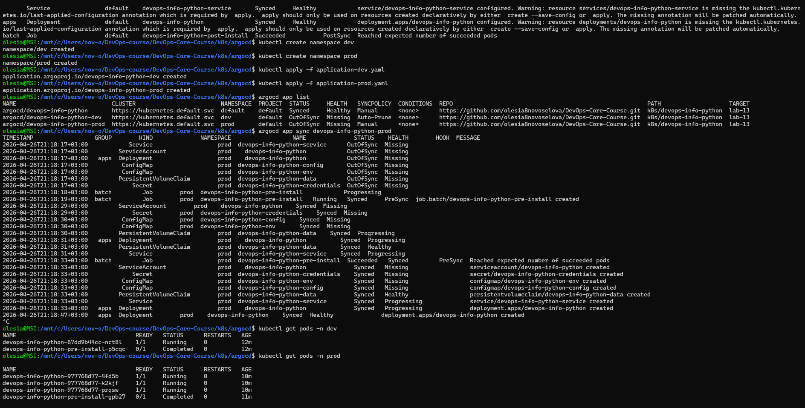
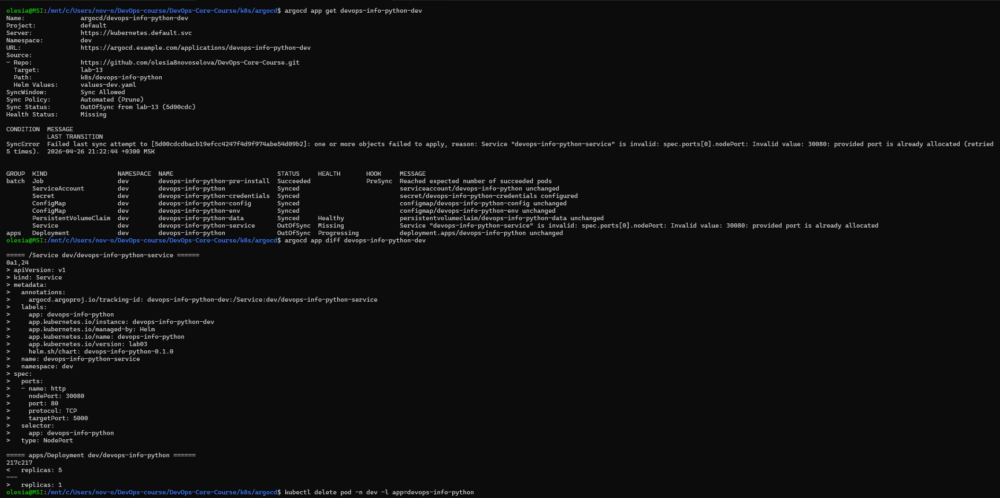
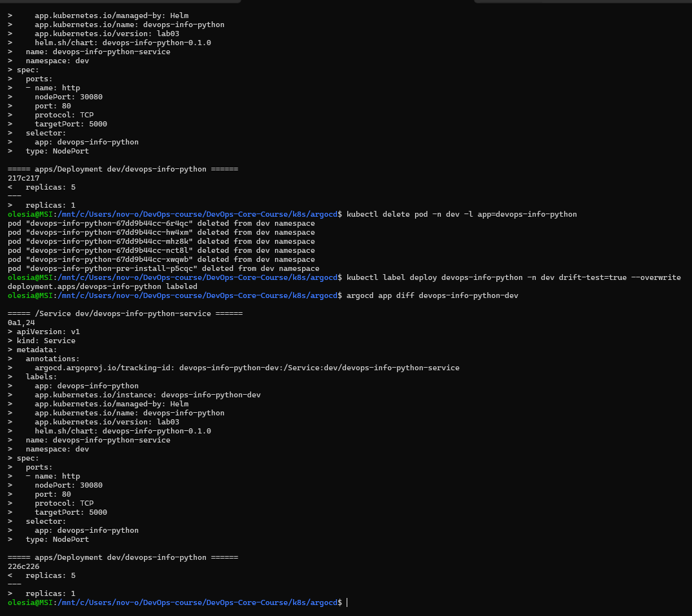
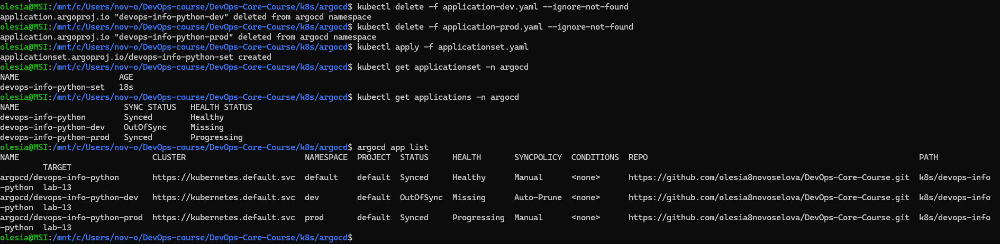
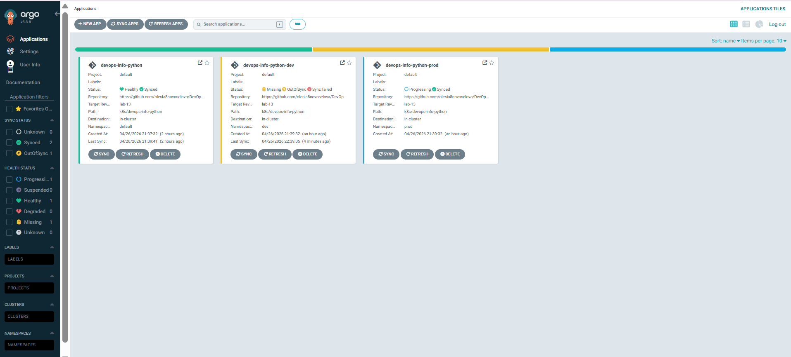

# LAB13 — GitOps with ArgoCD

## 1. ArgoCD setup

ArgoCD is installed in namespace `argocd` with Helm. The UI is opened through port-forward, and the CLI is used to manage applications.

**Commands**

```bash
helm repo add argo https://argoproj.github.io/argo-helm
helm repo update
kubectl create namespace argocd
helm install argocd argo/argo-cd -n argocd
kubectl get pods -n argocd

kubectl -n argocd get secret argocd-initial-admin-secret -o jsonpath="{.data.password}" | base64 -d; echo
kubectl port-forward svc/argocd-server -n argocd 8080:443

argocd login localhost:8080 --insecure
argocd version --client
```

**Evidence**



---

## 2. Application deployment

Main application manifest: `k8s/argocd/application.yaml`.

- Source: `k8s/devops-info-python`
- Revision: `lab-13`
- Values file: `values.yaml`
- Destination namespace: `default`
- Sync policy: manual

**Commands**

```bash
kubectl apply -f k8s/argocd/application.yaml
argocd app get devops-info-python
argocd app sync devops-info-python
argocd app wait devops-info-python --health --sync
```

**Evidence**



---

## 3. Multi-environment deployment

Environment-specific manifests:

- `k8s/argocd/application-dev.yaml` uses `values-dev.yaml` and deploys to `dev`
- `k8s/argocd/application-prod.yaml` uses `values-prod.yaml` and deploys to `prod`

Dev uses auto-sync with `prune` and `selfHeal`. Prod stays manual.

**Commands**

```bash
kubectl create namespace dev
kubectl create namespace prod

kubectl apply -f k8s/argocd/application-dev.yaml
kubectl apply -f k8s/argocd/application-prod.yaml

argocd app list
argocd app sync devops-info-python-prod
```

**Evidence**



---

## 4. Self-healing and drift

Dev environment is used for self-healing tests.

**Commands**

```bash
kubectl scale deployment devops-info-python -n dev --replicas=5
argocd app get devops-info-python-dev
argocd app diff devops-info-python-dev

kubectl delete pod -n dev -l app=devops-info-python

kubectl label deploy devops-info-python -n dev drift-test=true --overwrite
argocd app diff devops-info-python-dev
```

**Explanation**

- Kubernetes recreates deleted pods through the Deployment/ReplicaSet controller.
- ArgoCD corrects configuration drift when auto-sync and self-heal are enabled.
- ArgoCD checks Git periodically, so sync is not immediate unless triggered manually.

**Evidence**




---

## 5. Bonus — ApplicationSet

ApplicationSet is used to generate dev and prod applications from one template.

**Manifest**

- `k8s/argocd/applicationset.yaml`

**Commands**

```bash
kubectl apply -f k8s/argocd/applicationset.yaml
kubectl get applicationset -n argocd
kubectl get applications -n argocd
argocd app list
```

**Evidence**


