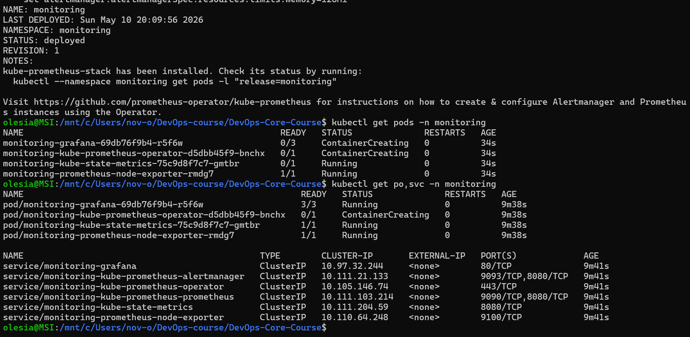
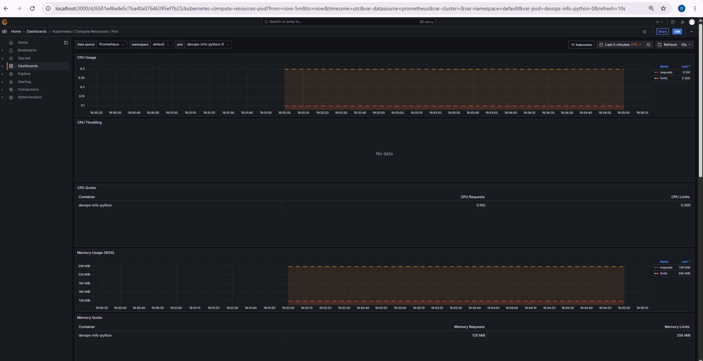
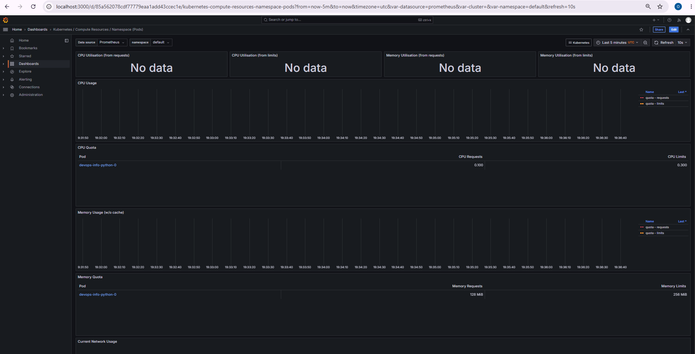
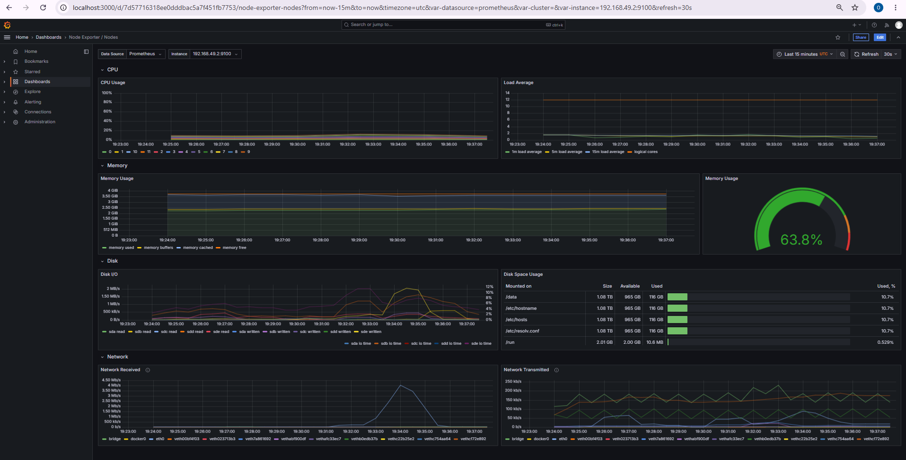
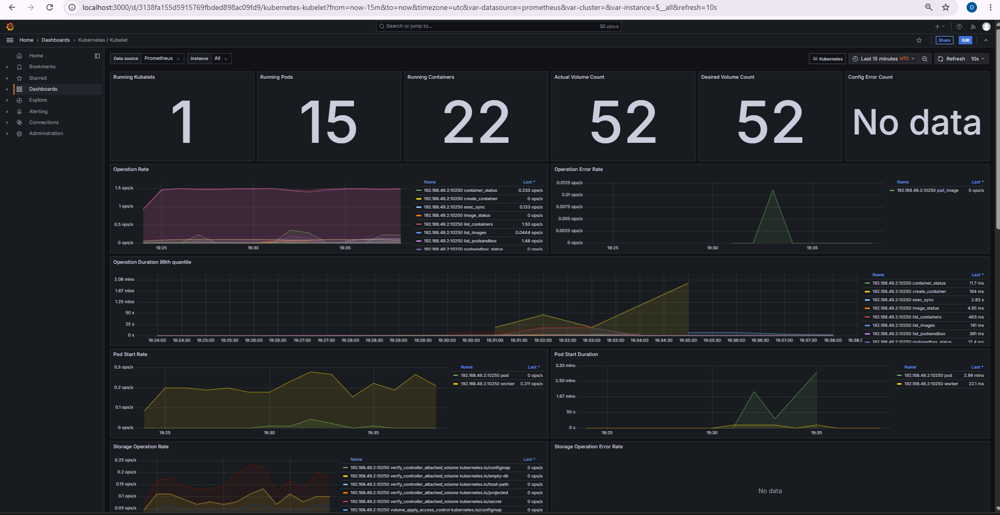
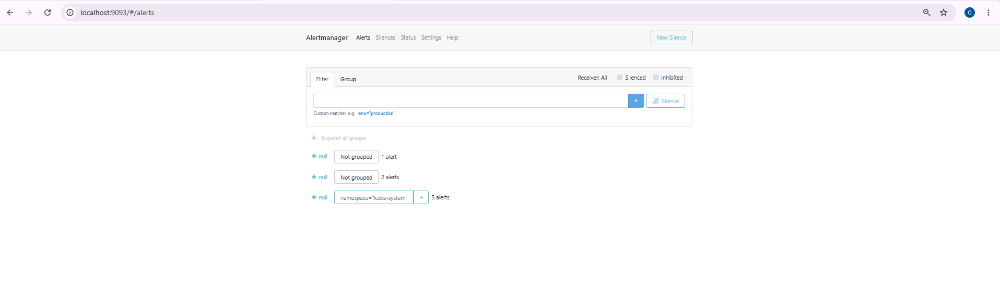
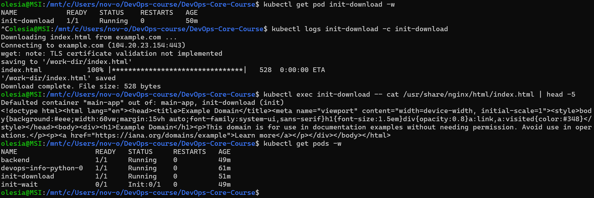

# LAB16 — Kubernetes Monitoring & Init Containers

## 1. Task 1 — Kube-Prometheus stack

### 1.1 Component roles

**Prometheus Operator** manages Prometheus and Alertmanager instances as Kubernetes custom resources. It watches `ServiceMonitor`, `PrometheusRule`, and `Alertmanager` CRDs and reconciles the actual Prometheus configuration without manual restarts.

**Prometheus** is the time-series database and scraper. It pulls metrics from targets on a configured interval, stores them locally, and evaluates alerting rules.

**Alertmanager** receives alerts fired by Prometheus, deduplicates them, groups related alerts, applies silences and inhibitions, and routes notifications to receivers such as email, Slack, or PagerDuty.

**Grafana** is the visualization layer. It connects to Prometheus as a data source and provides pre-built dashboards for cluster, node, workload, and network metrics.

**kube-state-metrics** is a metrics exporter that reads Kubernetes object state (Deployments, Pods, Nodes, PVCs, etc.) from the API server and exposes them as Prometheus metrics.

**node-exporter** runs as a DaemonSet on every node and exposes hardware and OS metrics: CPU, memory, disk I/O, network, and filesystem usage.

---

### 1.2 Installation

```bash
helm repo add prometheus-community https://prometheus-community.github.io/helm-charts
helm repo update

helm install monitoring prometheus-community/kube-prometheus-stack \
  --namespace monitoring \
  --create-namespace \
  --wait --timeout 10m
```

### 1.3 Verification

```bash
kubectl get pods -n monitoring
```

**Evidence**




---

## 2. Task 2 — Grafana dashboard exploration

### Access

```bash
# Grafana — http://localhost:3000  (admin / prom-operator)
kubectl port-forward svc/monitoring-grafana -n monitoring 3000:80

# Alertmanager — http://localhost:9093
kubectl port-forward svc/monitoring-kube-prometheus-alertmanager -n monitoring 9093:9093
```

---

### 2.1 Pod resources — CPU and memory of the StatefulSet

Dashboard: `Kubernetes / Compute Resources / Pod`

**Evidence**



---

### 2.2 Namespace analysis — most and least CPU in default namespace

Dashboard: `Kubernetes / Compute Resources / Namespace (Pods)`

**Evidence**



---

### 2.3 Node metrics — memory usage and CPU cores

Dashboard: `Node Exporter / Nodes`

**Evidence**



---

### 2.4 Kubelet — pods and containers managed

Dashboard: `Kubernetes / Kubelet`

**Evidence**



---

### 2.5 Network — traffic for pods in default namespace

Dashboard: `Kubernetes / Compute Resources / Namespace (Pods)` — Network section

---

### 2.6 Alerts — active alerts in Alertmanager

```bash
kubectl port-forward svc/monitoring-kube-prometheus-alertmanager -n monitoring 9093:9093
# open http://localhost:9093
```

Active alerts at time of check: Watchdog (always-firing sentinel alert, expected), plus any node or pod resource warnings.

**Evidence**



---

## 3. Task 3 — Init containers

### 3.1 Basic init container — file download

File: `k8s/init-download.yaml`

The init container uses `busybox:1.36` to `wget` `https://example.com` into an `emptyDir` volume at `/work-dir`. Once it exits with code 0, Kubernetes starts the main `nginx` container which mounts the same volume at `/usr/share/nginx/html` and serves the downloaded page.

```bash
kubectl apply -f k8s/init-download.yaml
kubectl get pod init-download -w
```
View init container logs:

```bash
kubectl logs init-download -c init-download
```

Verify the main container can read the file:

```bash
kubectl exec init-download -- cat /usr/share/nginx/html/index.html | head -5
```


**Evidence**




---

### 3.2 Wait-for-service pattern

File: `k8s/init-wait.yaml`

Three resources are applied together: `backend-service` (ClusterIP), `backend` (nginx pod), and `init-wait` (app pod with init container). The init container loops `nslookup backend-service` every 2 seconds until DNS resolves, then exits so the main container can start. This guarantees the main app only starts once its dependency is reachable.

```bash
kubectl apply -f k8s/init-wait.yaml
kubectl get pods -w
```
---

### 3.3 Cleanup

```bash
kubectl delete pod init-download
kubectl delete -f k8s/init-wait.yaml
```