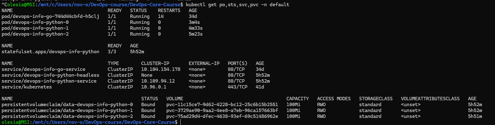
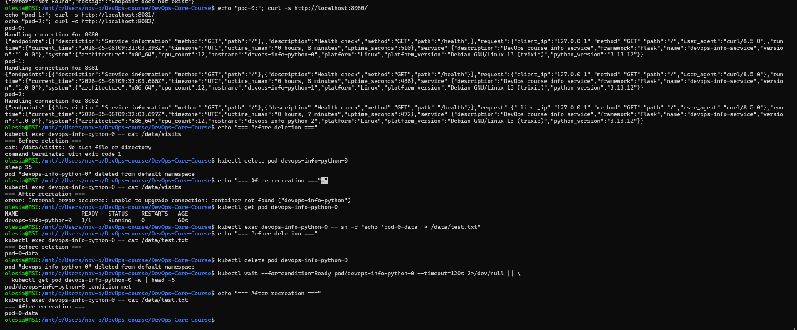
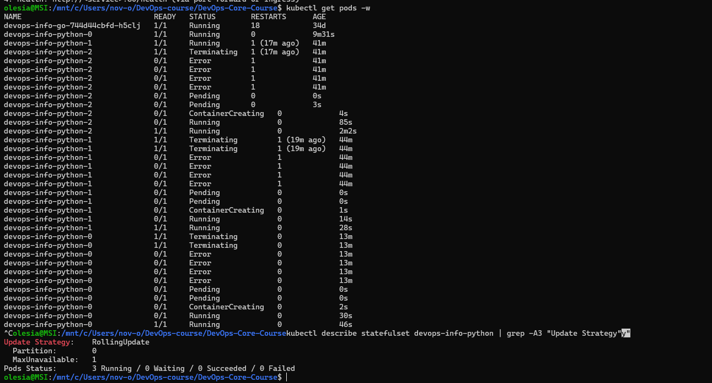
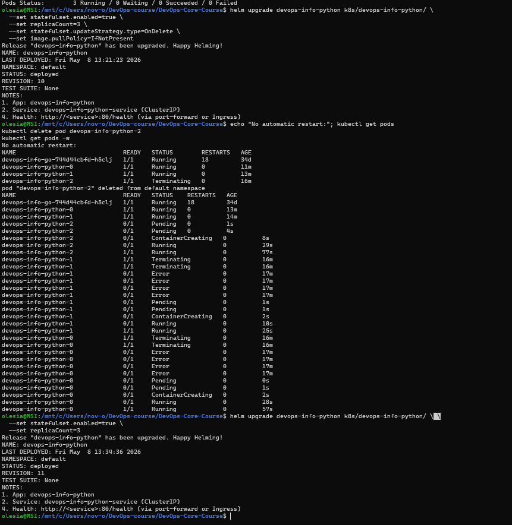

# LAB15 — StatefulSets & Persistent Storage

## 1. Task 1 — StatefulSet concepts

### 1.1 StatefulSet guarantees

StatefulSets provide three guarantees that Deployments cannot offer:

- **Stable network identities.** Each pod gets a unique, predictable hostname in the form `{name}-{ordinal}`. The name never changes across restarts.
- **Stable persistent storage.** Each pod keeps its own PersistentVolumeClaim across deletions and rescheduling. The PVC is not removed when the pod is deleted.
- **Ordered deployment and scaling.** Pods are created in ascending order (0 → 1 → 2) and terminated in descending order (2 → 1 → 0). Each pod must be ready before the next one starts.

### 1.2 Deployment vs StatefulSet

| Feature | Deployment | StatefulSet |
|---------|------------|-------------|
| Pod names | Random suffix (`app-abc123`) | Ordered index (`app-0`, `app-1`) |
| Storage | Shared PVC or none | Per-pod PVC via `volumeClaimTemplates` |
| Scaling order | Any order | Sequential (0 → 1 → 2) |
| Network identity | Random DNS name | Stable DNS name |
| Typical use case | Stateless apps | Stateful apps requiring identity |

Use a Deployment for web servers, REST APIs, and microservices that have no per-instance state. Use a StatefulSet for databases, message queues, and distributed systems that need stable hostnames or per-instance storage.

### 1.3 Headless Services

A Service with `clusterIP: None` is called a headless service. Instead of a single cluster IP, Kubernetes creates a DNS A record for each pod directly:

```
{pod-name}.{headless-service}.{namespace}.svc.cluster.local
```

This lets pods discover and talk to each other by a predictable, stable name. It is required by StatefulSets for pod DNS registration.

---

## 2. Task 2 — StatefulSet implementation

### 2.1 Templates created

Three files were added or updated in `k8s/devops-info-python/templates/`:

- `statefulset.yaml` — StatefulSet controller with `serviceName`, `volumeClaimTemplates`, and the same pod spec as the Deployment. Rendered only when `statefulset.enabled: true`.
- `service-headless.yaml` — Headless service (`clusterIP: None`) for pod DNS registration. Rendered only when `statefulset.enabled: true`.
- `pvc.yaml` — Updated condition: the standalone PVC is created only when `statefulset.enabled: false`, preventing duplicate claims.

### 2.2 Values

StatefulSet is disabled by default and enabled at deploy time:

```yaml
statefulset:
  enabled: false
  updateStrategy:
    type: RollingUpdate
    rollingUpdate:
      partition: 0
```

The existing `persistence` block is reused by the `volumeClaimTemplates`:

```yaml
persistence:
  enabled: true
  size: 100Mi
  storageClass: ""
  mountPath: /data
```

### 2.3 Deploy and verify

```bash
helm upgrade --install devops-info-python k8s/devops-info-python/ \
  --set statefulset.enabled=true \
  --set replicaCount=3

kubectl get po,sts,svc,pvc
```

**Evidence**



---

## 3. Task 3 — Headless Service & Pod identity

### 3.1 DNS resolution

Each pod can reach other pods by name through the headless service. From inside `devops-info-python-0`:

```bash
kubectl exec -it devops-info-python-0 -- /bin/sh -c \
  "nslookup devops-info-python-1.devops-info-python-headless"
```

Expected answer: `devops-info-python-1.devops-info-python-headless.default.svc.cluster.local` resolves to the pod IP.

### 3.2 Per-pod visit count

Each pod has its own PVC and maintains an independent visits counter at `/data/visits`. Sending traffic to each pod separately shows different counts:

```bash
kubectl port-forward pod/devops-info-python-0 8080:5000 &
kubectl port-forward pod/devops-info-python-1 8081:5000 &
kubectl port-forward pod/devops-info-python-2 8082:5000 &

curl http://localhost:8080/visits
curl http://localhost:8081/visits
curl http://localhost:8082/visits
```
### 3.3 Persistence after pod deletion

The visit count survives pod deletion because the PVC is not deleted with the pod. StatefulSet recreates the pod with the same ordinal and reattaches the same PVC.

```bash
# Record visit count
kubectl exec devops-info-python-0 -- cat /data/visits

# Delete the pod
kubectl delete pod devops-info-python-0

# Wait for recreation
kubectl wait --for=condition=Ready pod/devops-info-python-0 --timeout=60s

# Verify count is preserved
kubectl exec devops-info-python-0 -- cat /data/visits
```

**Evidence**



---

## 4. Bonus — Update strategies

### 4.1 Partitioned rolling update

With `partition: 2` only pods with ordinal >= 2 are updated when the image changes. Pods 0 and 1 keep the old version until the partition is lowered.

```yaml
statefulset:
  updateStrategy:
    type: RollingUpdate
    rollingUpdate:
      partition: 2
```

```bash
# Deploy with partition, then trigger update
helm upgrade devops-info-python k8s/devops-info-python/ \
  --set statefulset.enabled=true \
  --set replicaCount=3 \
  --set statefulset.updateStrategy.rollingUpdate.partition=2 \
  --set image.tag=latest

kubectl get pods -w
```

Only `devops-info-python-2` restarts. Pods 0 and 1 remain on the old image until partition is set to 0.

**Evidence**



### 4.2 OnDelete strategy

With `type: OnDelete`, pods are not updated automatically. They only pick up the new template when manually deleted. This gives full control over the update sequence.

```yaml
statefulset:
  updateStrategy:
    type: OnDelete
```

Use case: databases or distributed systems where the operator must validate each node individually before proceeding.

```bash
helm upgrade devops-info-python k8s/devops-info-python/ \
  --set statefulset.enabled=true \
  --set statefulset.updateStrategy.type=OnDelete \
  --set image.tag=latest

# Pods are NOT restarted yet
kubectl get pods

# Manually trigger update for pod-2
kubectl delete pod devops-info-python-2
kubectl get pods -w
```

**Evidence**

