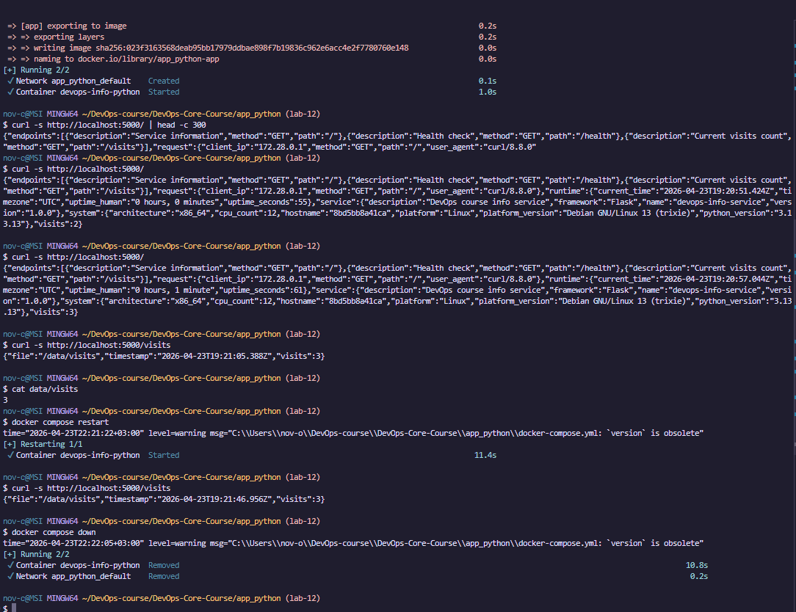
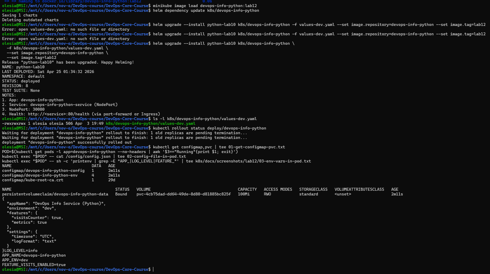
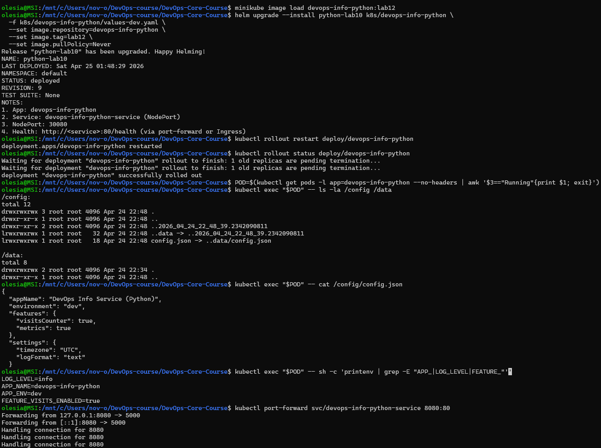
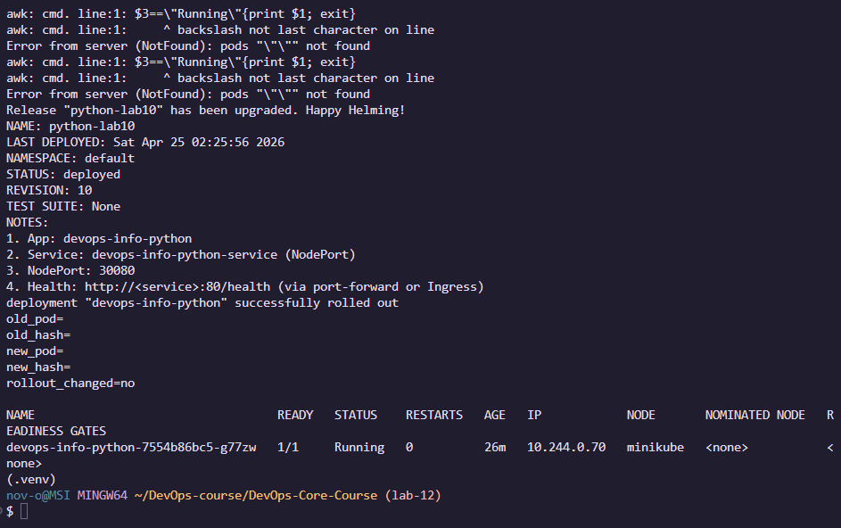

# LAB012 — ConfigMaps and Persistent Volumes Report

## 1. Task 1 — Application persistence upgrade

### Implemented changes

- Added file-based visits counter in Python service using `VISITS_FILE` (default `/data/visits`).
- `GET /` increments and persists counter.
- Added `GET /visits` endpoint for current counter value.
- Added lock and atomic write (`os.replace`) for safer updates.
- Added local Docker volume mount in `app_python/docker-compose.yml` for `/data` persistence.

### Evidence

- `k8s/docs/screenshots/lab12/04-visits-before-delete.txt`
- `k8s/docs/screenshots/lab12/05-pod-delete.txt`
- `k8s/docs/screenshots/lab12/06-visits-file-after-restart.txt`
- `k8s/docs/screenshots/lab12/07-visits-after-delete.txt`

## 2. Task 2 — ConfigMaps

### Implemented changes

- File-based config source: `k8s/devops-info-python/files/config.json`.
- File ConfigMap template: `k8s/devops-info-python/templates/configmap-file.yaml` using `.Files.Get`.
- Environment ConfigMap template: `k8s/devops-info-python/templates/configmap-env.yaml`.
- Deployment mounts config to `/config` and injects env via `envFrom.configMapRef`.

### Verification evidence required by lab

- `k8s/docs/screenshots/lab12/01-get-configmap-pvc.txt`
- `k8s/docs/screenshots/lab12/02-config-file-in-pod.txt`
- `k8s/docs/screenshots/lab12/03-env-vars-in-pod.txt`

## 3. Task 3 — Persistent Volumes

### Implemented changes

- PVC template added: `k8s/devops-info-python/templates/pvc.yaml`.
- PVC mounted in deployment at `/data`.
- Counter file path in app is `/data/visits`.

### Persistence test evidence required by lab

- Before pod deletion (`/visits`): `k8s/docs/screenshots/lab12/04-visits-before-delete.txt`
- Pod deletion output: `k8s/docs/screenshots/lab12/05-pod-delete.txt`
- Visits file after pod restart (`cat /data/visits`): `k8s/docs/screenshots/lab12/06-visits-file-after-restart.txt`
- `/visits` after restart: `k8s/docs/screenshots/lab12/07-visits-after-delete.txt`

## 4. ConfigMap vs Secret

### When to use ConfigMap

- Non-sensitive application configuration.
- Feature flags.
- Plain-text config files.

### When to use Secret

- Passwords, tokens, API keys, certificates, and other sensitive values.

### Key difference

- ConfigMap is for non-sensitive data.
- Secret is for sensitive data and should be protected with RBAC and encryption at rest.

## 5. Bonus — ConfigMap hot reload

### 5.1 Default update behavior

- Mounted ConfigMap updates are delayed (kubelet sync + cache), not instantaneous.

### 5.2 `subPath` limitation

- `subPath` mounts do not receive live ConfigMap updates.
- Directory mount should be used for update propagation.

### 5.3 Implemented reload approach

- Deployment uses checksum annotations:
  - `checksum/config-file`
  - `checksum/config-env`
- Helm config changes update pod template and trigger rollout.

### Bonus evidence

- Delay measurement file: `k8s/docs/screenshots/lab12/08-bonus-delay.txt`
- Checksum rollout evidence: `k8s/docs/screenshots/lab12/09-bonus-checksum-rollout.txt`
