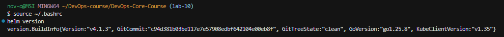
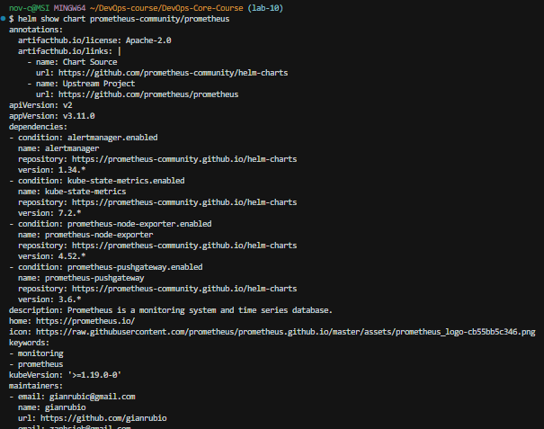
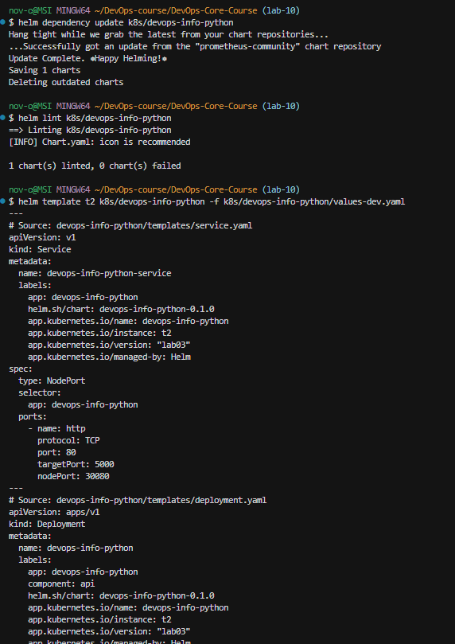
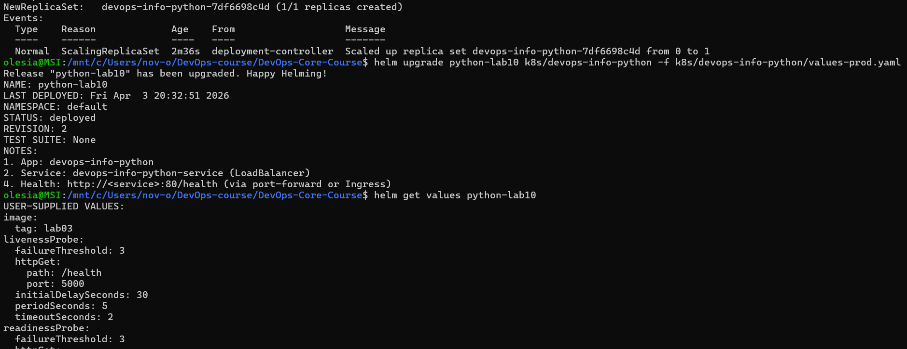
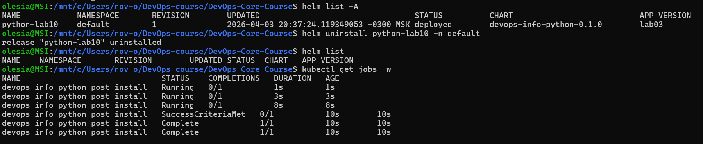
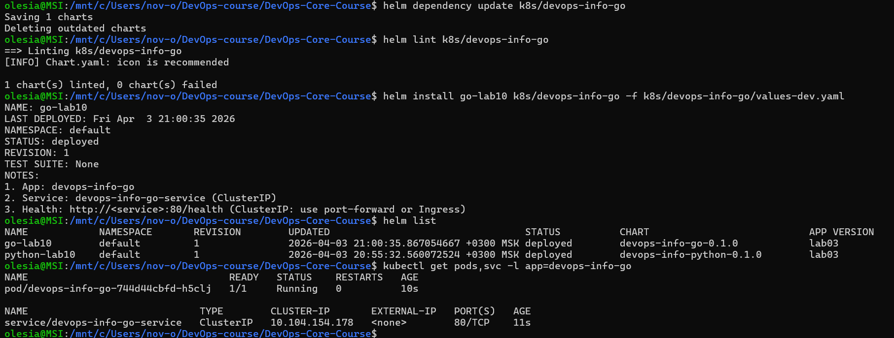
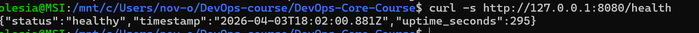

# LAB10 — Helm package manager

## 1. Task 1 — Helm fundamentals

**Helm value proposition:** Charts + values give repeatable installs per environment, versioned releases, rollbacks, and lifecycle hooks—without duplicating YAML by hand.

**Commands**

```bash
helm version
helm repo add prometheus-community https://prometheus-community.github.io/helm-charts
helm repo update
helm show chart prometheus-community/prometheus
```

**Screenshots**





---

## 2. Task 2 — Chart from LAB09 manifests

**What was done**

- Python Deployment + NodePort Service → `k8s/devops-info-python/templates/`.
- Settings come from `values.yaml`; shared naming/labels from `k8s/common-lib` (`include "common.*"`).

**Commands**

```bash
helm dependency update k8s/devops-info-python
helm lint k8s/devops-info-python
```

**Screenshot**



---

## 3. Task 3 — Multi-environment values

**Files**

- `k8s/devops-info-python/values-dev.yaml` — 1 replica, lighter resources, NodePort `30080`.
- `k8s/devops-info-python/values-prod.yaml` — 3 replicas, stronger resources, `LoadBalancer` (on Minikube `EXTERNAL-IP` stays `<pending>` unless `minikube tunnel`).

**Commands**

```bash
helm install python-lab10 k8s/devops-info-python -f k8s/devops-info-python/values-dev.yaml
helm get values python-lab10
kubectl describe deployment devops-info-python

helm upgrade python-lab10 k8s/devops-info-python -f k8s/devops-info-python/values-prod.yaml
helm get values python-lab10
kubectl get deployment devops-info-python -o jsonpath='{.spec.replicas}{"\n"}'
kubectl get svc devops-info-python-service -o wide
```

**Screenshot**



---

## 4. Task 4 — Hooks

**Implementation**

- **pre-install** Job — weight `-5`, `helm.sh/hook-delete-policy: hook-succeeded`.
- **post-install** Job — weight `5`, same delete policy.

Templates: `k8s/devops-info-python/templates/hooks/`.

**Commands**

```bash
helm uninstall python-lab10
# Terminal A:
kubectl get jobs -w
# Terminal B:
helm install python-lab10 k8s/devops-info-python -f k8s/devops-info-python/values-dev.yaml
```

**Screenshot**



---

## 5. Task 5 — Documentation

See **`k8s/HELM.md`** (chart layout, values, hooks, operations, testing, bonus / library).

---

## 6. Bonus — Library chart + second app

**Commands**

```bash
helm dependency update k8s/devops-info-go
helm lint k8s/devops-info-go
helm install go-dev k8s/devops-info-go -f k8s/devops-info-go/values-dev.yaml
helm list
kubectl get pods -l app=devops-info-go
```


**Screenshots**





---

## 7. What I learned

- Values files are easier than editing manifests for each environment.
- Install hooks run once per `helm install`; catching them needs `kubectl get jobs -w` or events, because `hook-succeeded` deletes Jobs after they finish.
- A small library chart keeps labels and names consistent between the Python and Go charts.
