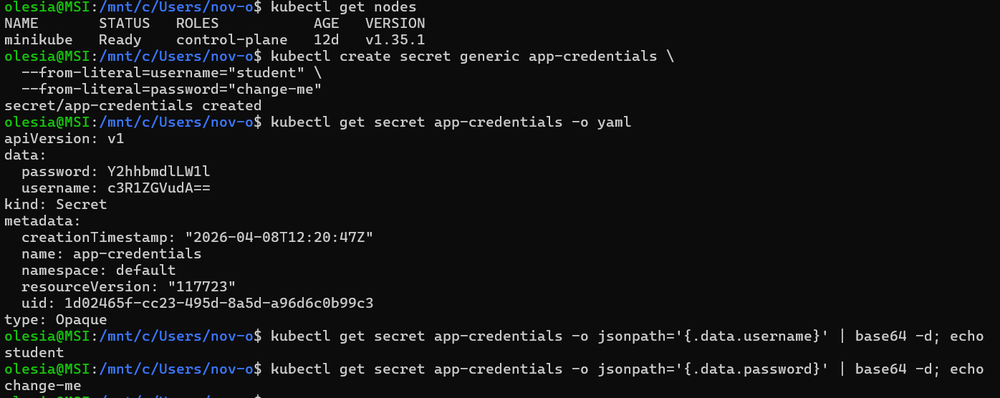
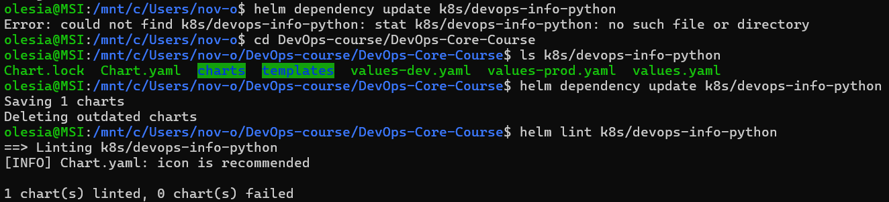
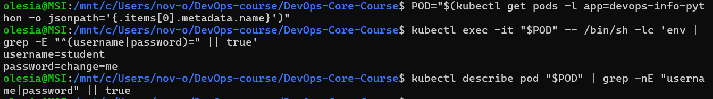
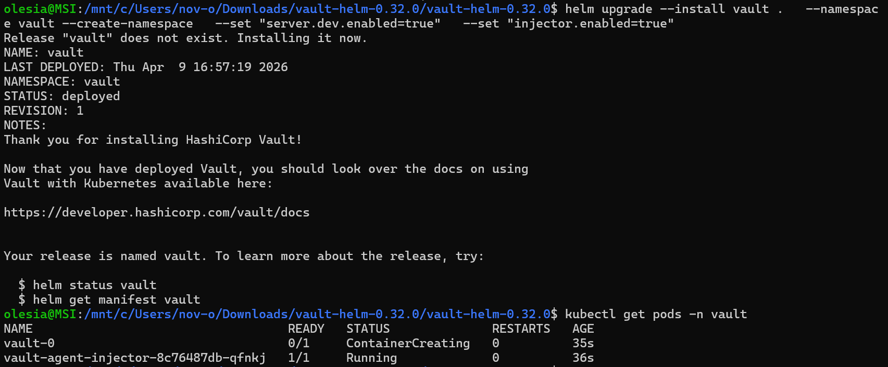
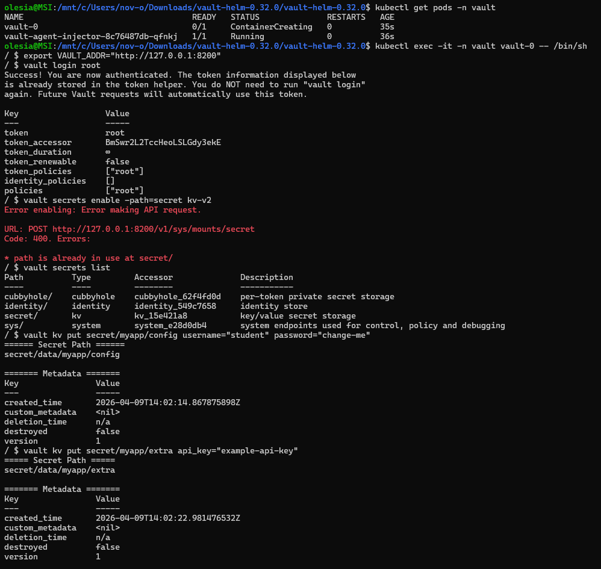
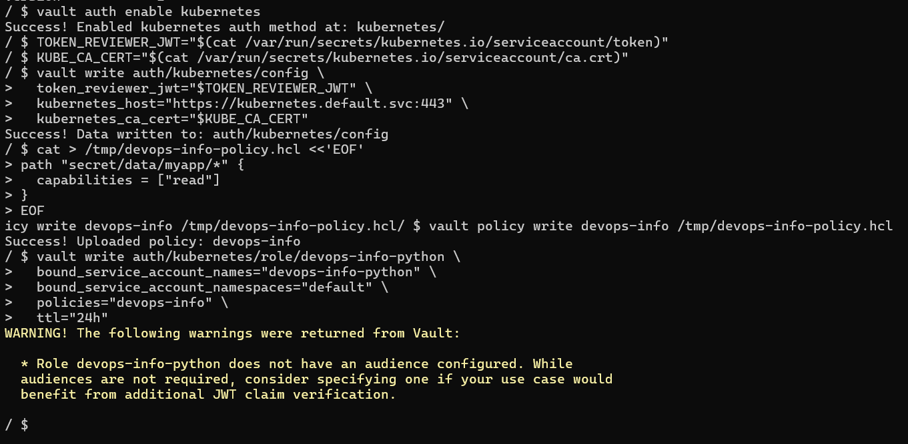
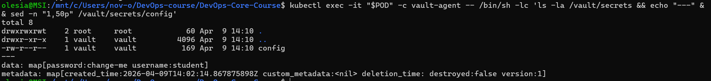
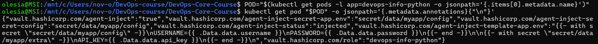
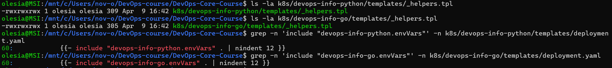

# LAB11 — Kubernetes Secrets & HashiCorp Vault

## 1. Task 1 — Kubernetes Secrets fundamentals

### Create a secret, examine the secret (YAML), decode base64 values

**Evidence**

### Encoding vs encryption

- **Base64 encoding** is reversible and provides **no security**.
- **Encryption** requires a key to decrypt and protects data in storage/backups.

### 1.5 Security implications

- **Encrypted at rest by default?** No. By default, Kubernetes Secrets are base64-encoded and stored in **etcd**.
- **etcd encryption**: API server can encrypt Secret resources before writing to etcd (EncryptionConfiguration).
- **When to enable**: production clusters, regulated environments, or anywhere etcd backups/snapshots may be accessible.

---

## 2. Task 2 — Helm-managed secrets

### 2.2 Secret injection into Deployment

Pattern used: **`envFrom.secretRef`**

**Files**

- `k8s/devops-info-python/templates/deployment.yaml`
- `k8s/devops-info-go/templates/deployment.yaml`

### Verify secret injection inside the Pod, get a pod and check env vars exist, ensure values are not exposed by describe:

**Evidence**

### 2.4 Resource vs limits (best practices)

- **requests**: scheduler-guaranteed minimum to place the pod
- **limits**: maximum allowed usage (CPU throttling / memory OOMKill)

---

## 3. Task 3 — HashiCorp Vault integration

### 3.1 Install Vault via Helm

**Evidence**

### 3.2 Configure Vault KV v2 and store secrets

**Evidence**

### 3.3 Enable Kubernetes auth + policy + role

**Evidence**

### 3.4 Enable Vault Agent injection in the app Deployment
**Evidence**

### 3.5 Sidecar injection pattern

- Vault Injector mutates the pod and adds a **Vault Agent** (init + sidecar).
- The agent authenticates to Vault via **Kubernetes auth** (service account JWT).
- Secrets are written as **files** under `/vault/secrets/`.

---

## 4. Task 4 — Security analysis

### Kubernetes Secrets vs Vault

- **Kubernetes Secret**: simple, native, good for low/medium sensitivity if RBAC is strict and etcd encryption is enabled.
- **Vault**: centralized policies + audit + token-based access, supports rotation/dynamic secrets (when using proper engines).

### Production recommendations

- Enable **etcd encryption at rest**.
- Use strict **RBAC** and least privilege.
- Avoid storing real secrets in Git; inject via external secret manager or secure CI variables.

---

## 5. Bonus — Vault Agent templates + Helm named templates (DRY)

### 5.1 Vault Agent template rendering (`/vault/secrets/app.env`)

**Evidence**

### 5.2 Dynamic secret refresh + `agent-inject-command`

- Vault Agent keeps tokens valid (renews leases) and periodically refreshes/re-renders templates.
- `vault.hashicorp.com/agent-inject-command` can run a command after rendering (useful to reload app config).

### 5.3 Helm named templates for env vars

Implemented for DRY:

- `k8s/devops-info-python/templates/_helpers.tpl` -> `include "devops-info-python.envVars" .`
- `k8s/devops-info-go/templates/_helpers.tpl` -> `include "devops-info-go.envVars" .`

**Evidence**
