# Lab 18 — Reproducible Builds with Nix

## Overview

This lab explores reproducible builds using Nix. The DevOps Info Service from Lab 1 is rebuilt with a Nix derivation, containerised with `dockerTools` instead of a traditional `Dockerfile`, and modernised with a Nix Flake. Each step is compared directly with the Lab 1 / Lab 2 / Lab 10 approach to show what reproducibility guarantees Nix adds.

---

## Task 1 — Build Reproducible Python App

### 1.1 Install Nix

Install using the Determinate Systems installer, which enables flakes by default:

```bash
curl --proto '=https' --tlsv1.2 -sSf -L https://install.determinate.systems/nix | sh -s -- install
```

After installation, restart the terminal and verify:

```bash
nix --version
# Nix 2.x.x
```

Test that Nix can run a package without installing it permanently:

```bash
nix run nixpkgs#hello
```

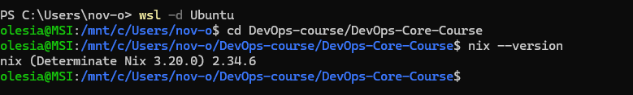

### 1.2 Prepare the Python Application

The application is copied from the top-level `app_python/` directory used in Labs 1–4:

```bash
mkdir -p labs/lab18/app_python
cp app_python/app.py app_python/requirements.txt labs/lab18/app_python/
cd labs/lab18/app_python
```

The existing `requirements.txt` has:

```
Flask
prometheus-client==0.23.1
```

### 1.3 Nix Derivation (`default.nix`)

The derivation file is at `labs/lab18/app_python/default.nix`.

```nix
{ pkgs ? import <nixpkgs> {} }:

let
  pythonEnv = pkgs.python3.withPackages (ps: with ps; [
    flask
    prometheus-client
  ]);
in

pkgs.stdenv.mkDerivation {
  pname   = "devops-info-service";
  version = "1.0.0";
  src = ./.;
  nativeBuildInputs = [ pkgs.makeWrapper ];

  installPhase = ''
    mkdir -p $out/bin $out/lib/devops-info-service
    cp app.py $out/lib/devops-info-service/app.py
    makeWrapper ${pythonEnv}/bin/python3 $out/bin/devops-info-service \
      --add-flags "$out/lib/devops-info-service/app.py"
  '';
}
```

Key fields explained:

- `pkgs ? import <nixpkgs> {}` — uses the system channel unless an explicit `pkgs` argument is passed (the flake passes a pinned one).
- `python3.withPackages` — builds a self-contained Python interpreter that already has Flask and prometheus-client on its path. No `pip install` happens at runtime.
- `src = ./.` — Nix hashes the source tree and includes that hash in the store path. Any code change produces a new, different store path.
- `nativeBuildInputs = [ pkgs.makeWrapper ]` — brings the `makeWrapper` helper into the build sandbox.
- `installPhase` — copies `app.py` into `$out/lib/` and creates an executable wrapper at `$out/bin/devops-info-service` that calls the sandboxed Python.

Build the application:

```bash
cd labs/lab18/app_python
nix-build
```

Run it (override `VISITS_FILE` to avoid needing root access to `/data`):

```bash
VISITS_FILE=/tmp/visits ./result/bin/devops-info-service
# then curl http://localhost:5000/health
```

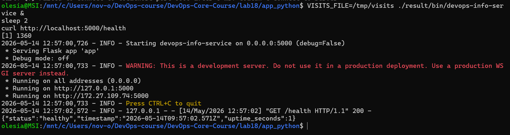

### 1.4 Prove Reproducibility

**First build — record the store path:**

```bash
readlink result
# /nix/store/5379pgvnp93nnjbmqxbic9adgwdnyb8c-devops-info-service-1.0.0
```

**Delete the store path and rebuild:**

```bash
STORE_PATH=$(readlink result)
rm result
nix-store --delete "$STORE_PATH"
nix-build
readlink result
# /nix/store/bqjwbgh2ynvjmsfpay3b1mnfsnwpwfg0-devops-info-service-1.0.0
```

**Observed finding:** the two builds produced **different** store paths (`5379...` vs `bqjwb...`).

This occurred because `default.nix` uses `import <nixpkgs> {}` — a floating reference to the local Nix channel. The first build was a **binary cache hit** from `cache.nixos.org`, which served a pre-built binary compiled against one nixpkgs revision. The second build compiled locally against the current channel state, which had diverged slightly (different nixpkgs commit → different Python or dependency hashes → different output hash).

This is a real-world demonstration that channel-based `nix-build` is only *approximately* reproducible: it depends on the local channel being in the same state as when the cache entry was created. The Bonus task (Flake) solves this by locking nixpkgs to an exact git commit in flake.lock.

**Hash the output of the second build:**

```bash
nix-hash --type sha256 result
# 37301bf1151f5fa030daf530e73db3e38e6e0827ae4d5f5bcee600d0d5068f9e
```

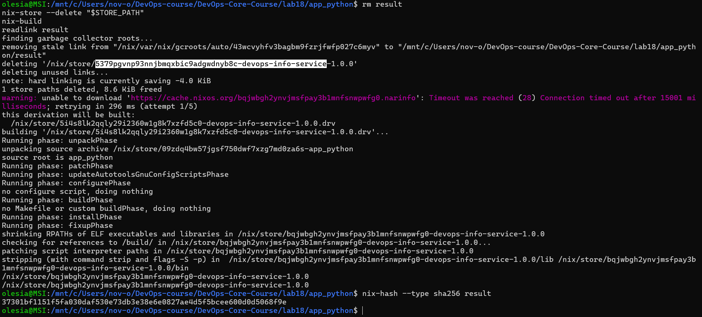

**Demonstrate pip's limitations:**

```bash
echo "flask" > requirements-unpinned.txt

python3 -m venv venv1 && source venv1/bin/activate
pip install -r requirements-unpinned.txt
pip freeze | grep -i flask > freeze1.txt
deactivate

pip cache purge 2>/dev/null || rm -rf ~/.cache/pip

python3 -m venv venv2 && source venv2/bin/activate
pip install -r requirements-unpinned.txt
pip freeze | grep -i flask > freeze2.txt
deactivate

diff freeze1.txt freeze2.txt
```

Without a pinned version, `pip install` pulls whatever is latest on PyPI. Even with a pinned direct dependency, transitive dependencies (Werkzeug, Click, MarkupSafe, …) are not pinned and can drift between installs.

### Nix store path format

```
/nix/store/<hash>-<name>-<version>
           ^^^^^^
           SHA256 of all inputs:
             - source code (content hash)
             - all dependencies (transitively)
             - build instructions (installPhase, etc.)
             - compiler flags
           If any input changes, the hash changes.
```

This is called a content-addressable store. It means:

1. The same inputs always produce the same hash.
2. Two builds with the same hash are guaranteed to be identical.
3. Nix can safely share binaries via `cache.nixos.org` because the hash is proof of content.

### Comparison: Lab 1 (pip + venv) vs Lab 18 (Nix)

| Aspect | Lab 1 (pip + venv) | Lab 18 (Nix) |
|---|---|---|
| Python version | System-dependent | Pinned in derivation |
| Dependency resolution | Runtime (`pip install`) | Build-time (pure sandbox) |
| Transitive deps | Not pinned | Fully locked |
| Reproducibility | Approximate | Bit-for-bit identical |
| Portability | Requires same OS + Python | Works anywhere Nix runs |
| Binary cache | No | Yes (cache.nixos.org) |
| Isolation | Virtual environment | Sandboxed build, no network |
| Store path | N/A | Content-addressable hash |

**Why `requirements.txt` provides weaker guarantees than Nix:**

`requirements.txt` only pins the packages you list directly. It does not pin their transitive dependencies unless you also commit a full `pip freeze` output. Even with a lockfile, `pip install` uses the local system Python, local compiler, and local system libraries — all of which can vary between machines or over time. Nix pins every node in the entire dependency tree (including the C compiler, libc, and system libraries used to compile Python packages), so the resulting build is bit-for-bit identical across machines and time.

**Reflection — how Nix would have helped in Lab 1:**

In Lab 1, the virtual environment was created with whatever Python version happened to be installed on the machine. Any team member with a different Python minor version would get different behaviour. With Nix, the derivation would have pinned Python 3.13 exactly, along with Flask and all its transitive dependencies. New team members would just run `nix-build` and get the identical binary without any setup steps.

---

## Task 2 — Reproducible Docker Images

### 2.1 Review the Lab 2 Dockerfile

The existing Dockerfile is at `app_python/Dockerfile`:

```dockerfile
FROM python:3.13-slim

ENV PYTHONDONTWRITEBYTECODE=1 \
    PYTHONUNBUFFERED=1 \
    PORT=5000 \
    HOST=0.0.0.0 \
    VISITS_FILE=/data/visits

WORKDIR /app
RUN groupadd --system app && useradd --system --gid app --home /app --shell /usr/sbin/nologin app
COPY requirements.txt .
RUN pip install --no-cache-dir -r requirements.txt
COPY app.py .
RUN mkdir -p /data && chown -R app:app /app /data
EXPOSE 5000
USER app
CMD ["python", "app.py"]
```

**Test Lab 2 reproducibility (run from repository root):**

```bash
docker build -t lab2-app:v1 ./app_python
docker inspect lab2-app:v1 | grep '"Created"'

sleep 5

docker build -t lab2-app:v2 ./app_python
docker inspect lab2-app:v2 | grep '"Created"'
```

The `Created` timestamps differ between builds, and the image SHA256 digests differ as well.

### 2.2 Nix Docker Image (`docker.nix`)

The file is at `labs/lab18/app_python/docker.nix`.

```nix
{ pkgs ? import <nixpkgs> {} }:

let
  app = import ./default.nix { inherit pkgs; };
in

pkgs.dockerTools.buildLayeredImage {
  name     = "devops-info-service-nix";
  tag      = "1.0.0";
  contents = [ app pkgs.coreutils ];

  config = {
    Cmd          = [ "${app}/bin/devops-info-service" ];
    ExposedPorts = { "5000/tcp" = {}; };
    Env = [
      "PORT=5000"
      "HOST=0.0.0.0"
      "VISITS_FILE=/data/visits"
      "PYTHONDONTWRITEBYTECODE=1"
      "PYTHONUNBUFFERED=1"
    ];
  };

  created = "1970-01-01T00:00:01Z";
}
```

Key fields:

- `buildLayeredImage` — produces an OCI-compatible layered image. Each derivation in `contents` becomes its own layer, giving better caching when only one dependency changes.
- `contents` — only the packages listed here (and their Nix closure) are present. There is no `python:3.13-slim` base image; the image contains exactly what the app needs.
- `config.Cmd` — uses the full Nix store path of the wrapper binary, so there is no ambiguity.
- `created = "1970-01-01T00:00:01Z"` — a fixed epoch timestamp. Using `"now"` would embed the current time and make the tarball hash different on every build, defeating reproducibility. Docker displays this as "56 years ago" — this is intentional, not a bug.

**Build and load:**

```bash
cd labs/lab18/app_python
nix-build docker.nix
docker load < result
```

**Run both containers side by side:**

```bash
docker stop lab2-container nix-container 2>/dev/null || true
docker rm   lab2-container nix-container 2>/dev/null || true

docker run -d -p 5000:5000 -e VISITS_FILE=/tmp/visits --name lab2-container lab2-app:v1
docker run -d -p 5001:5000 -e VISITS_FILE=/tmp/visits --name nix-container  devops-info-service-nix:1.0.0

sleep 2
curl http://localhost:5000/health
curl http://localhost:5001/health
```

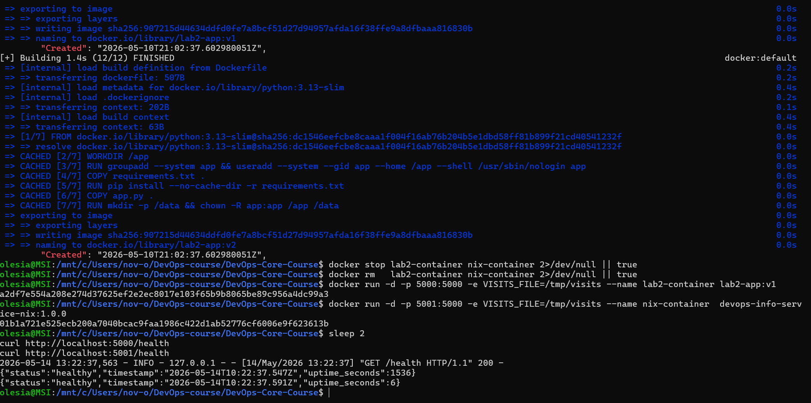

### 2.3 Reproducibility Comparison

**Rebuild Nix image twice and compare SHA256:**

```bash
cd labs/lab18/app_python

rm result && nix-build docker.nix && sha256sum result
rm result && nix-build docker.nix && sha256sum result
# Both lines print the same hash
```

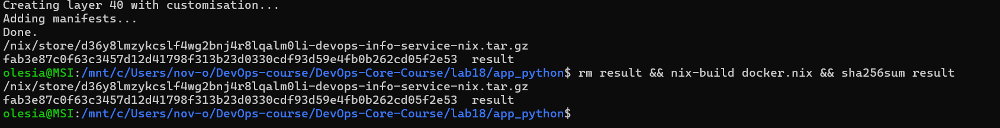

**Build Lab 2 Dockerfile twice and compare saved image hashes:**

```bash
# Run from repository root
docker build -t lab2-app:test1 ./app_python/
docker save lab2-app:test1 | sha256sum

sleep 2

docker build -t lab2-app:test2 ./app_python/
docker save lab2-app:test2 | sha256sum
# Different hashes, even though source is identical
```

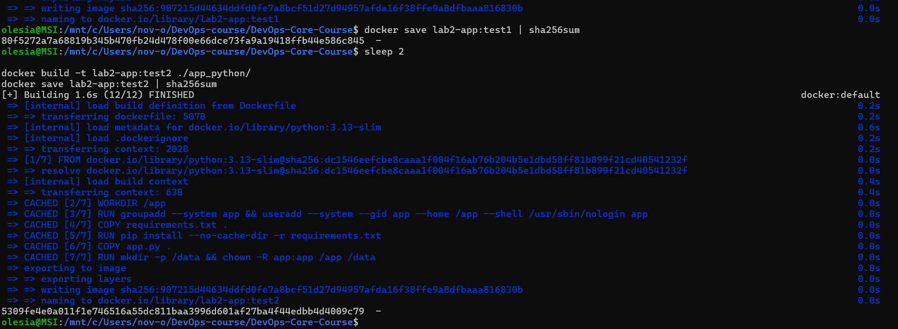

**Image size comparison:**

```bash
docker images | grep -E "lab2-app|devops-info-service-nix"
```

Note: the Nix image shows "56 years ago" as creation time because `created = "1970-01-01T00:00:01Z"` is set deliberately to make the image digest stable across builds.

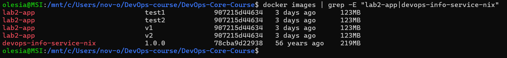

| Metric | Lab 2 Dockerfile | Lab 18 Nix dockerTools |
|---|---|---|
| Base image | `python:3.13-slim` (~130 MB) | None |
| Total image size | ~123 MB | ~219 MB (includes full Python closure) |
| Reproducibility | Different hashes each build | Identical hashes |
| Build caching | Layer-based, timestamp-dependent | Content-addressable |
| Timestamps | Current time on each build | Fixed epoch (1970) |

**Layer comparison:**

```bash
docker history lab2-app:v1
docker history devops-info-service-nix:1.0.0
```

Lab 2 layers show the current `CREATED` timestamp. Nix layers all show the epoch time because the content is content-addressed, not timestamp-addressed.

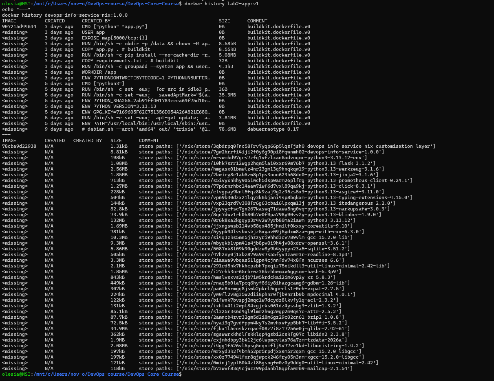

### Side-by-side comparison: Lab 2 Dockerfile vs Nix docker.nix

| Aspect | Lab 2 Dockerfile | Lab 18 Nix dockerTools |
|---|---|---|
| Base image | `python:3.13-slim` (changes over time) | No base image |
| Timestamps | Different on each build | Fixed epoch |
| Package installation | `pip install` at build time | Nix store paths (immutable) |
| Reproducibility | Different image per build | Identical image every time |
| Caching | Layer-based (breaks on timestamp) | Content-addressable |
| Security surface | Full base image packages | Minimal Nix closure only |

**Why traditional Dockerfiles cannot achieve bit-for-bit reproducibility:**

Every `docker build` embeds the current timestamp into the image metadata, so two builds of the same Dockerfile on the same source code produce images with different SHA256 digests. Base image tags like `python:3.13-slim` are mutable — the tag can point to a different underlying image after a security patch. `pip install` without hash pinning fetches the latest available packages, which change over time. Nix avoids all three problems: timestamps are fixed, every dependency is content-addressed, and builds run in a network-isolated sandbox that can only access pre-fetched, hash-verified inputs.

**Reflection — redoing Lab 2 with Nix:**

The Lab 2 Dockerfile follows Docker best practices (non-root user, `--no-cache-dir`). With Nix, I would keep the same application code but replace the Dockerfile with `docker.nix`. The resulting image would have no mutable base image dependency and produce identical digests across the CI pipeline, making rollbacks and audit trails reliable. The main trade-off is that team members need Nix installed, whereas Docker is more widely available today.

**Practical scenarios where Nix reproducibility matters:**

- **CI/CD pipelines:** Two CI runs on different days produce images with the same digest. The pipeline can skip rebuilds when the hash matches.
- **Security audits:** An auditor can rebuild the image from source and verify it matches the deployed digest. This is impossible with timestamp-dependent Docker builds.
- **Rollbacks:** A tagged release `1.2.3` built with Nix will always produce the same binary. With Docker, rebuilding the same tag may produce a different image if a base image changed.

---

## Bonus Task — Modern Nix with Flakes

### Bonus.1 Flake (`flake.nix`)

The file is at `labs/lab18/app_python/flake.nix`.

```nix
{
  description = "DevOps Info Service — reproducible Nix Flake build";

  inputs = {
    nixpkgs.url = "github:NixOS/nixpkgs/nixos-24.11";
  };

  outputs = { self, nixpkgs }:
    let
      system = "x86_64-linux";
      pkgs   = nixpkgs.legacyPackages.${system};
    in
    {
      packages.${system} = {
        default     = import ./default.nix { inherit pkgs; };
        dockerImage = import ./docker.nix  { inherit pkgs; };
      };

      devShells.${system}.default = pkgs.mkShell {
        buildInputs = with pkgs; [
          python3
          python3Packages.flask
          python3Packages.prometheus-client
          python3Packages.pytest
        ];
        shellHook = ''
          echo "DevOps Info Service dev shell ready."
          echo "Python: $(python3 --version)"
        '';
      };
    };
}
```

Key fields:

- `inputs.nixpkgs.url` — pins to the `nixos-24.11` branch. `nix flake update` resolves this to an exact git commit and writes it to `flake.lock`.
- `outputs` — a function that receives the locked inputs and produces packages and devShells.
- `packages.${system}.default` — reuses `default.nix` but now with a locked `pkgs`.
- `packages.${system}.dockerImage` — reuses `docker.nix` with the same locked `pkgs`.
- `devShells.${system}.default` — an isolated shell for development.

**Generate the lock file (files must be git-tracked first):**

```bash
cd labs/lab18/app_python
git add .
nix flake update
```

This creates `flake.lock` pinning the exact nixpkgs commit.

**Build using the flake:**

```bash
nix build
VISITS_FILE=/tmp/visits ./result/bin/devops-info-service &
sleep 2 && curl http://localhost:5000/health
kill %1 2>/dev/null || true
```

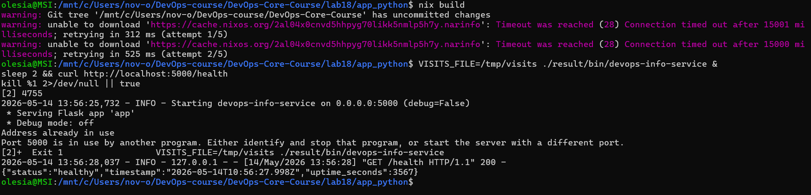

### `flake.lock` — locked dependencies

After `nix flake update`, `flake.lock` contains the exact nixpkgs commit:

```bash
cat flake.lock
```

The `rev` field is a specific git commit hash of the entire nixpkgs repository. All 80,000+ packages — including Python, Flask, every C library they depend on, and the compiler — are pinned to this single commit. This is what the channel-based `default.nix` lacks: without `flake.lock`, `import <nixpkgs> {}` resolves to whatever version is in the local channel at build time, which can differ between machines.

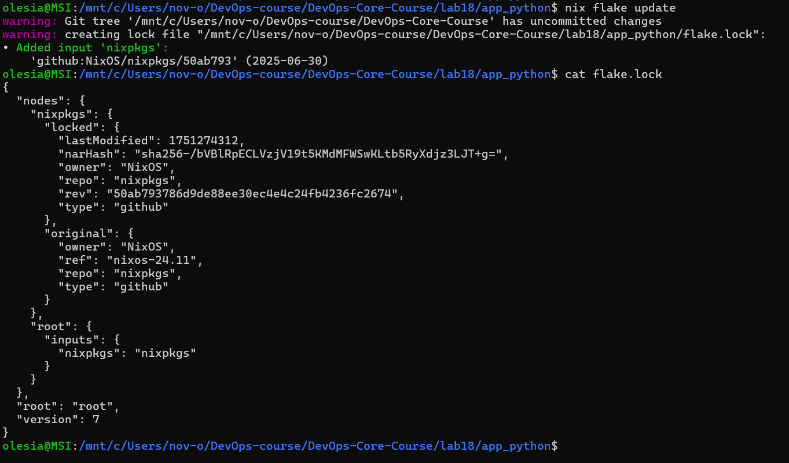

### Bonus.2 Comparison with Lab 10 Helm values.yaml

**Lab 10 approach** in `k8s/mychart/values.yaml`:

```yaml
image:
  repository: yourusername/devops-info-service
  tag: "1.0.0"
  pullPolicy: IfNotPresent
```

This pins the container image tag. Limitations:

- Only the tag is pinned; the image behind that tag can be overwritten on Docker Hub.
- Nothing inside the image (Python version, Flask version, transitive libs) is locked.
- Helm chart dependencies are not locked at the binary level.

**Nix Flakes approach** — `flake.lock` locks everything:

- The exact nixpkgs commit (every package in the universe)
- Python version and its C extensions
- Flask and all its transitive Python dependencies
- The C compiler and system libraries used to build them

| Aspect | Lab 1 (venv + requirements.txt) | Lab 10 (Helm values.yaml) | Lab 18 (Nix Flakes) |
|---|---|---|---|
| Locks Python version | No | No | Yes — pinned in flake |
| Locks direct deps | Approximate (versions drift) | Only image tag | Exact hashes |
| Locks transitive deps | No | No | Yes |
| Locks build tools | No | No | Yes |
| Reproducibility | Probabilistic | Tag-based | Cryptographic |
| Cross-machine identical | No | Depends on registry | Yes |
| Dev environment | venv (machine-dependent) | No | `nix develop` (identical) |
| Time-stable | No | Tags can change | Locked forever |

### Bonus.3 Development Shell

**Enter the dev shell:**

```bash
cd labs/lab18/app_python
nix develop
```

Inside the shell:

```bash
python3 --version
python3 -c "import flask; print(flask.__version__)"
exit
```

Exit and re-enter — the same Python version and the same Flask version are available every time, on every machine.

**Comparison with Lab 1 venv:**

The Lab 1 `venv` uses the system Python, which changes when the OS upgrades, and pip resolves dependency versions at activation time. `nix develop` uses the `flake.lock`-pinned Python and packages — the environment is identical on every machine without any manual setup.

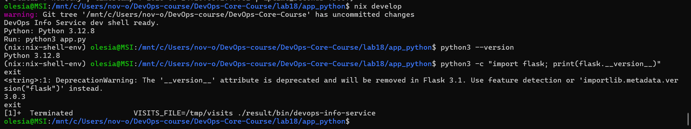

**Reflection — how Flakes improve on traditional dependency management:**

With `requirements.txt`, a developer must manually run `pip freeze` and commit the output to get a reproducible environment — and even then, only direct dependencies are captured cleanly. With a Flake, `nix flake update` generates `flake.lock` automatically and captures every dependency at every level. Committing `flake.lock` to git means that `git clone` + `nix build` is sufficient to reproduce any past build, forever.

**Practical scenario where `flake.lock` prevented a "works on my machine" problem:**

A developer upgrades their local `nixpkgs` channel, which silently updates Flask from 3.0 to 3.1. With a Flake, the `nixpkgs` revision is locked in `flake.lock`. Any team member or CI runner that checks out the same commit gets the same Flask version, regardless of what is installed on their machine. The lock file acts as the single source of truth.

---

## Files Produced

```
labs/
  submission18.md
  lab18/
    app_python/
      app.py
      requirements.txt
      default.nix
      docker.nix
      flake.nix
      flake.lock
      docs/
        screenshots/
          lab18/
            01-nix-version.png
            02-nix-build-run.png
            03-reproducible-store-path.png
            04-both-containers.png
            05-nix-image-sha256.png
            06-dockerfile-sha256-diff.png
            07-image-sizes.png
            08-docker-history.png
            09-flake-build.png
            10-flake-lock.png
            11-nix-develop.png
```