# LAB07 — Observability & Logging with Loki Stack

## 1. Architecture

Stack: **Loki 3.0** (log store) + **Promtail 3.0** (collector) + **Grafana 12.3** (UI) + Python and Go apps.

Flow:
```
Apps (8000, 8001) → stdout
       ↓
Docker containers → log files
       ↓
Promtail (Docker socket + /var/lib/docker/containers) → discovers containers, reads logs
       ↓
Loki (3100) ← Promtail pushes logs
       ↓
Grafana (3000) → queries Loki, shows Explore + dashboards
```

- **Labels:** Promtail sends `container`, `container_id`, `app` (from Docker labels). LogQL uses these to filter.
- **Storage:** Loki uses TSDB + filesystem under `/tmp/loki`, schema v13, 7-day retention.

---

## 2. Setup Guide

**Prerequisites:** Docker + Docker Compose v2; images `devops-info-python:lab03` and `devops-info-go:lab03` (or set `DOCKERHUB_USERNAME` and use Docker Hub).

**Steps:**

1. From repo root:
   ```bash
   cd DevOps-Core-Course/monitoring
   export DOCKERHUB_USERNAME="your_username"
   docker compose up -d
   docker compose ps
   ```
2. Verify:
   ```bash
   curl http://127.0.0.1:3101/ready
   curl http://127.0.0.1:9081/targets
   curl http://127.0.0.1:3000/api/health
   ```
3. Open Grafana: `http://localhost:3000`. Add data source **Loki**, URL `http://loki:3100`, Save & Test.
4. In **Explore** (Loki), run e.g. `{container=~"devops-python|devops-go|loki"}` to see logs from 3+ containers.

**Evidence (Task 1):** Logs from at least 3 containers in Grafana Explore.

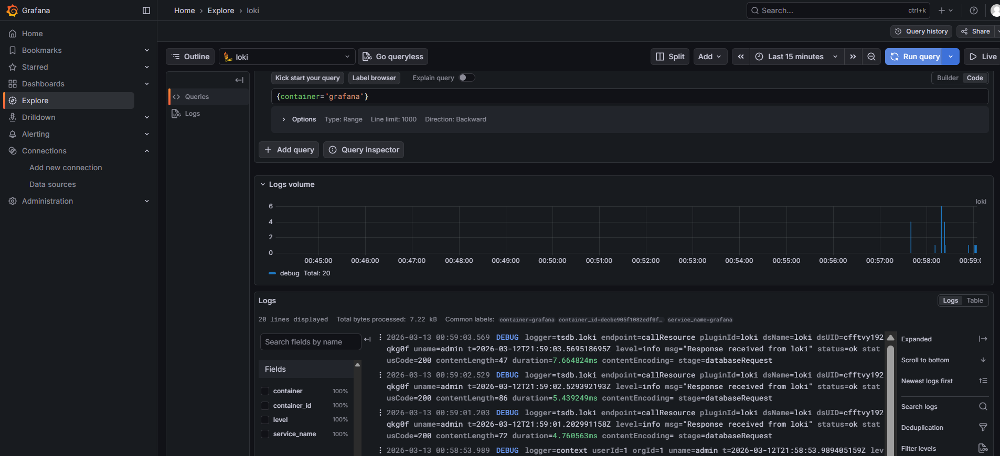
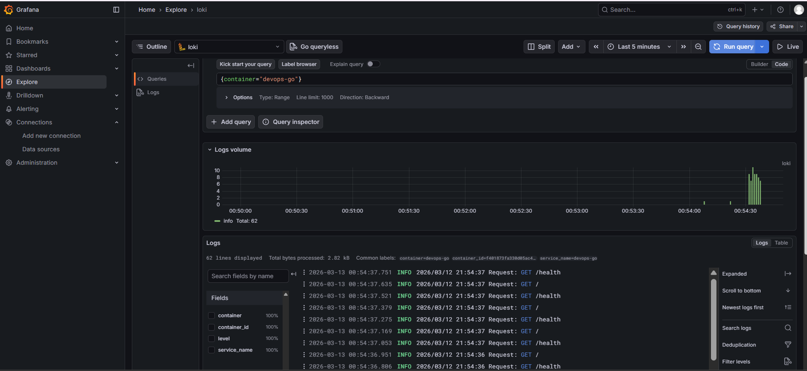
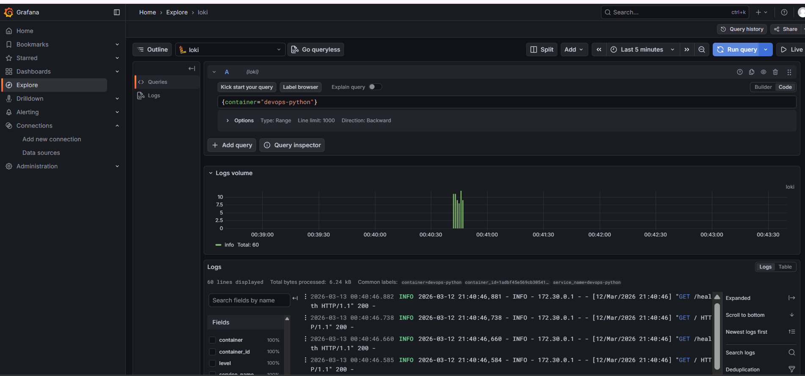

---

## 3. Configuration

**Docker Compose:** One network `logging`; services loki, promtail, grafana, app-python, app-bonus. Loki host port 3101→3100, Promtail 9081→9080 (so they don’t conflict). Apps have labels `logging: "promtail"` and `app: "devops-python"` / `app: "devops-go"`.

**Loki** (`loki/config.yml`): Server on 3100; `common.path_prefix` and storage under `/tmp/loki` (writable without volume); schema v13 + TSDB + filesystem; `limits_config.retention_period: 168h` (7 days). No compactor `shared_store` (removed in Loki 3.0).

Snippet:
```yaml
schema_config:
  configs:
    - from: 2024-01-01
      store: tsdb
      object_store: filesystem
      schema: v13
limits_config:
  retention_period: 168h
```

**Promtail** (`promtail/config.yml`): Sends to `http://loki:3100/loki/api/v1/push`. Docker discovery via `docker_sd_configs` and `unix:///var/run/docker.sock`. Relabels: `container` from container name (strip leading `/`), `container_id`, and `app` from Docker label `app`.

Snippet:
```yaml
clients:
  - url: http://loki:3100/loki/api/v1/push
scrape_configs:
  - job_name: docker
    docker_sd_configs:
      - host: unix:///var/run/docker.sock
        refresh_interval: 5s
    relabel_configs:
      - source_labels: [__meta_docker_container_name]
        target_label: container
        regex: "/(.*)"
        replacement: "$1"
      - source_labels: [__meta_docker_container_label_app]
        target_label: app
        regex: "(.+)"
        replacement: "$1"
```

---

## 4. Application Logging

Python app (Lab 1) was updated to log in **JSON**: one line per event with `timestamp`, `level`, `message`, and HTTP context (`method`, `path`, `status_code`, `client_ip`). Implemented with a custom `JSONFormatter` (or e.g. python-json-logger). Flask: `@app.before_request` logs request, `@app.after_request` logs response; error handlers log at ERROR. JSON allows LogQL to use `| json` and filter by `level`, `method`, etc.

**Evidence (Task 2):** JSON log line.

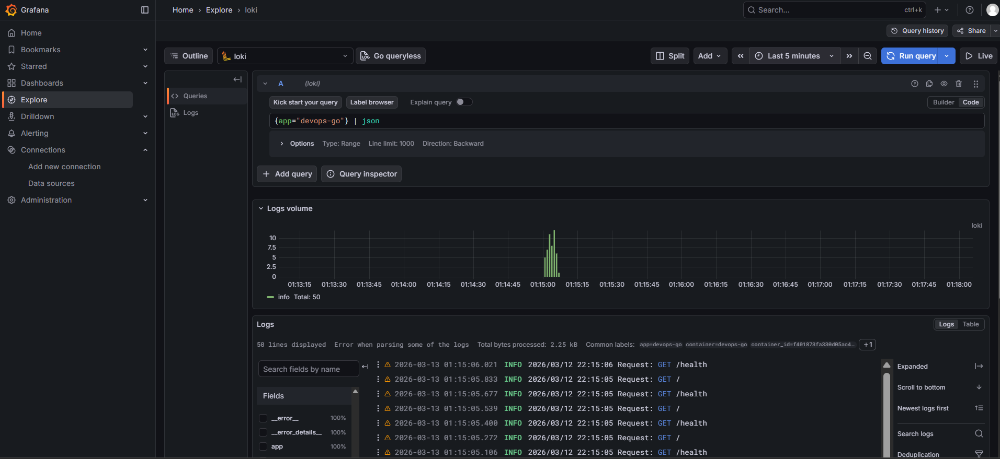

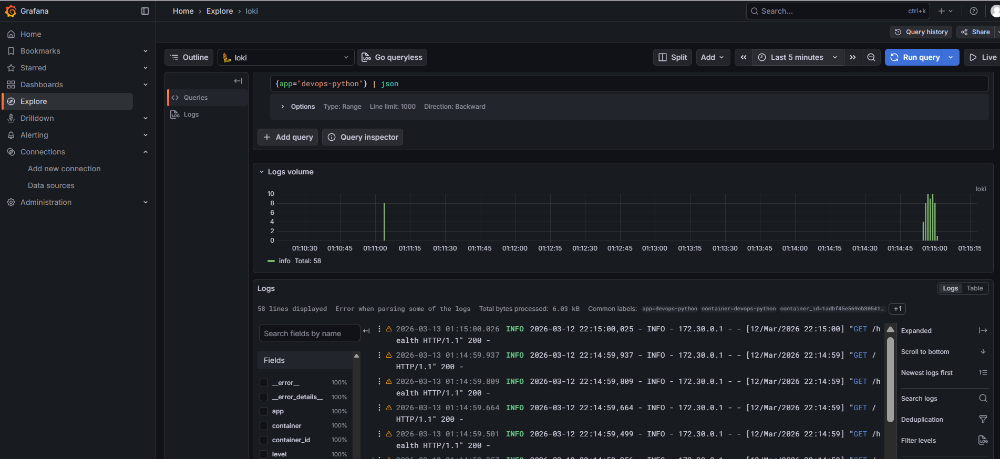

---

## 5. Dashboard

Data source: **Loki** with URL `http://loki:3100`.

Four panels:

| Panel               | Type        | LogQL query                                                                 |
|---------------------|------------|-----------------------------------------------------------------------------|
| Logs Table          | Logs       | `{app=~"devops-.*"}` — recent logs from both apps                          |
| Request Rate        | Time series| `sum by (app) (rate({app=~"devops-.*"}[1m]))` — logs/sec per app           |
| Error Logs          | Logs       | `{app=~"devops-.*"} \| json \| level="ERROR"` — only ERROR level            |
| Log Level Distribution | Pie | `sum by (level) (count_over_time({app=~"devops-.*"} \| json [5m]))` — count by level |


**Evidence (Task 3):** Screenshot of the dashboard with all 4 panels

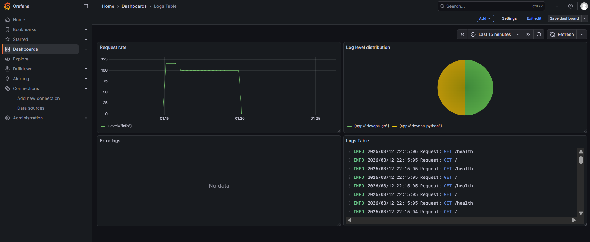

---

## 6. Production Config

- **Resource limits:** All services have `deploy.resources.limits` (and reservations) in `docker-compose.yml` (e.g. Loki/Grafana 1 CPU, 1G RAM).
- **Grafana:** `GF_AUTH_ANONYMOUS_ENABLED=false`. Admin user/password via `GF_SECURITY_ADMIN_USER` and `GF_SECURITY_ADMIN_PASSWORD` (use `.env` in real use).
- **Retention:** Loki `limits_config.retention_period: 168h` (7 days).
- **Health checks:** Loki `curl -f http://localhost:3100/ready`, Promtail `http://localhost:9080/ready`, Grafana `http://localhost:3000/api/health` in `healthcheck:`.

**Evidence (Task 4):** `docker compose ps` showing services healthy; screenshot of Grafana login (no anonymous access).

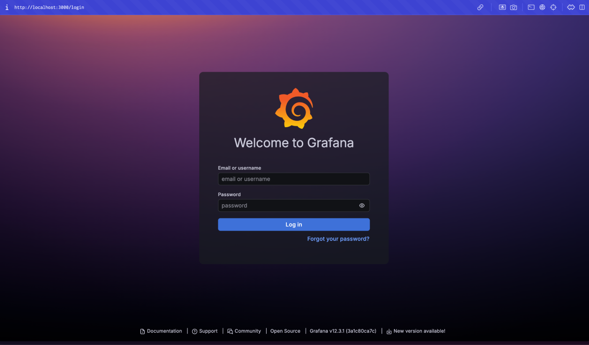
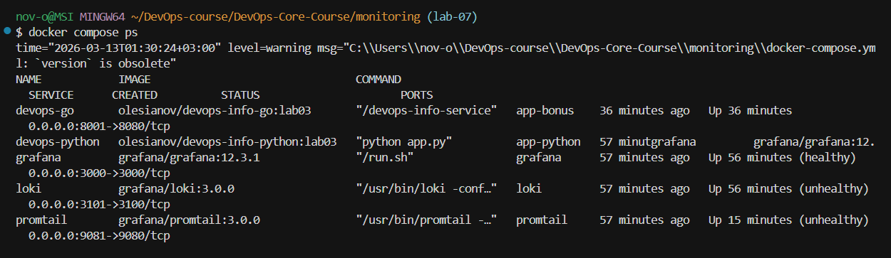

---

## 7. Testing

**Generate logs:**
```bash
for i in $(seq 1 20); do curl -s http://127.0.0.1:8000/ > /dev/null; curl -s http://127.0.0.1:8000/health > /dev/null; done
for i in $(seq 1 20); do curl -s http://127.0.0.1:8001/ > /dev/null; curl -s http://127.0.0.1:8001/health > /dev/null; done
```

**LogQL evidence:**

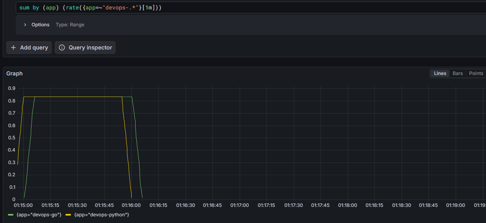
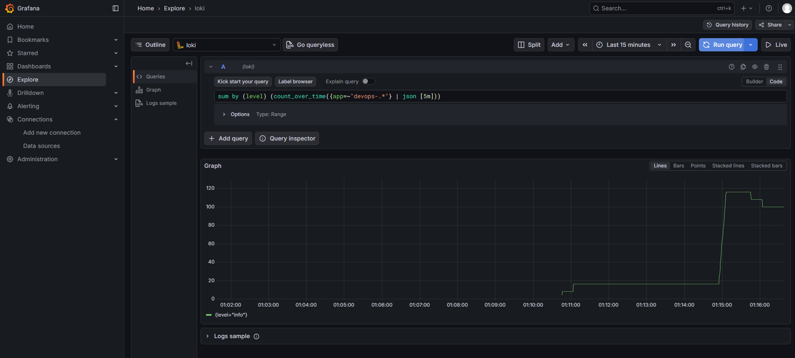

---

## 8. Challenges

- **Loki permission denied:** With a volume on `/var/loki`, Loki failed with “permission denied” creating rules dir. Switched to `/tmp/loki` (no volume) so the process can write.

---

## Bonus — Ansible automation

**Role:** `ansible/roles/monitoring/` — templates `docker-compose.yml`, Loki and Promtail configs to `{{ monitoring_dir }}` (default `/opt/monitoring`), deploys with `community.docker.docker_compose_v2`, waits for Grafana and Loki ready, then creates Grafana **Loki** data source via API (`http://loki:3100`). Depends on **docker** role.

**Run (WSL):**
```bash
cd DevOps-Core-Course/ansible
ansible-playbook -i inventory/hosts.ini playbooks/deploy-monitoring.yml --ask-vault-pass
```
**Idempotency:** Run again; second run should show **changed=0** for template/compose if nothing changed.

**Evidence:**

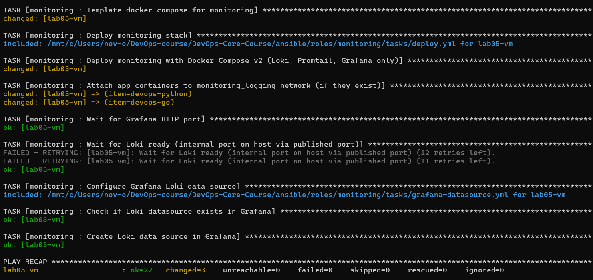
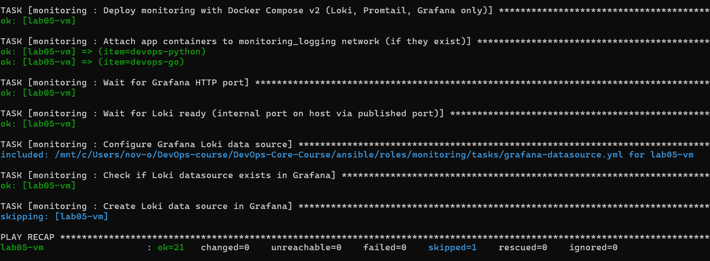