# LAB08 — Metrics & Monitoring with Prometheus

## 1. Architecture

Stack: **Prometheus 3.9+** (metrics store) + **Grafana 12.3** (visualization) + Loki 3.0 + Promtail 3.0 (logs) + Python and Go apps.

Flow:
```
Apps (8000, 8001) → /metrics endpoint
       ↓
Prometheus (9090) ← scrapes metrics every 15s
       ↓
Grafana (3000) → queries Prometheus, shows dashboards
```

- **Metrics:** Counter (requests), Gauge (in-progress), Histogram (duration)
- **Labels:** method, endpoint, status for HTTP metrics
- **Storage:** Prometheus TSDB with 15d retention, 10GB limit

---

## 2. Setup Guide

**Prerequisites:** Docker + Docker Compose v2

To build the app images locally:

```bash
docker build -t devops-info-python:lab03 ../app_python
docker build -t devops-info-go:lab03 ../app_go
```

**Steps:**

1. From repo root:
   ```bash
   cd DevOps-Core-Course/monitoring
   export DOCKERHUB_USERNAME="your_username"
   docker compose up -d
   docker compose ps
   ```
2. Verify:
   ```bash
   curl http://127.0.0.1:9090/-/healthy
   curl http://127.0.0.1:3101/ready
   curl http://127.0.0.1:3000/api/health
   curl http://127.0.0.1:8000/metrics | head -n 30
   ```
3. Prometheus: `http://localhost:9090`. Check targets at `/targets`.
4. Grafana: `http://localhost:3000`.

**Evidence (Task 1-2):** Metrics from app at `/metrics`, targets UP in Prometheus.

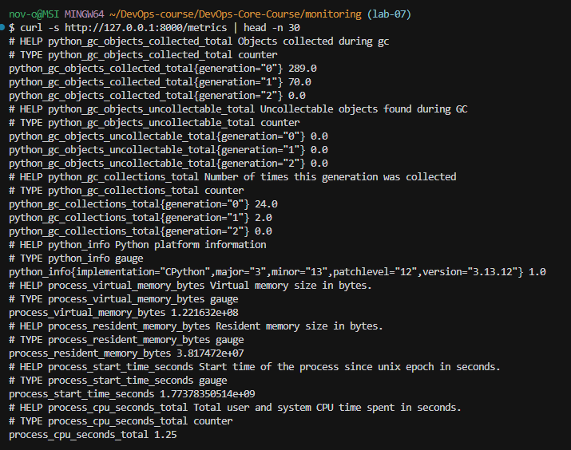
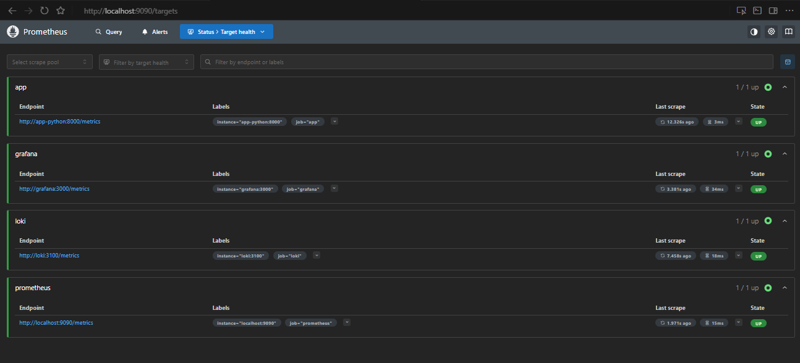
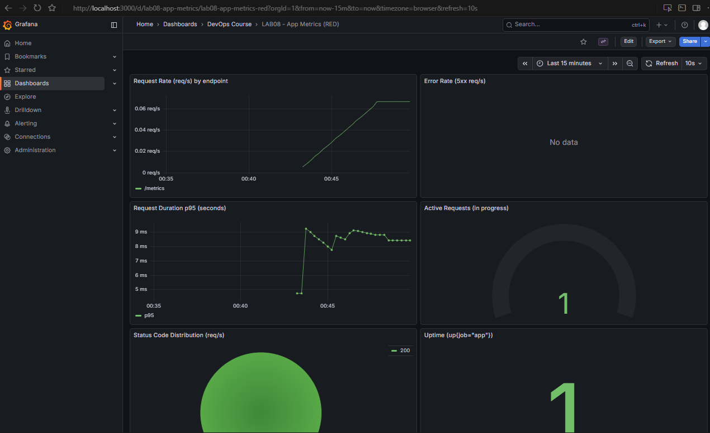
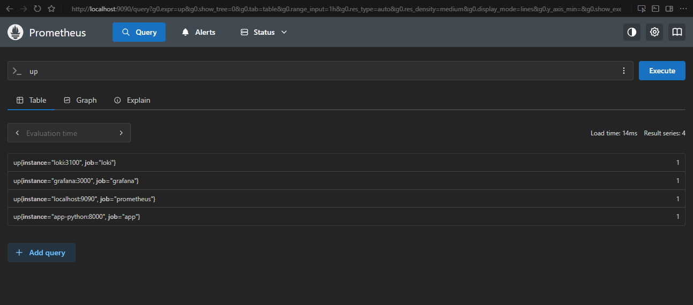

---

## 3. Application Instrumentation

Python app updated with **prometheus_client**:

- **Counter:** `http_requests_total` - total requests by method, endpoint, status
- **Gauge:** `http_requests_in_progress` - concurrent requests
- **Histogram:** `http_request_duration_seconds` - request latency by method, endpoint
- **App metrics:** `devops_info_endpoint_calls` (counter), `devops_info_system_collection_seconds` (histogram)

Instrumentation in `@app.before_request` (start timer, inc gauge), `@app.after_request` (dec gauge, observe duration, inc counter).

---

## 4. Prometheus Configuration

**File:** `monitoring/prometheus/prometheus.yml`

Key points:
- `scrape_interval: 15s`
- jobs: `prometheus`, `loki`, `grafana`, `app`
- uses Docker Compose service names as targets (e.g. `loki:3100`)

**Retention:** 15d time, 10GB size.

---

## 5. Grafana Dashboards

Data source: **Prometheus** with URL `http://prometheus:9090`.

Panels:

| Panel | Type | Query |
|-------|------|-------|
| Request Rate | Time series | `sum(rate(http_requests_total[5m])) by (endpoint)` |
| Error Rate | Time series | `sum(rate(http_requests_total{status=~"5.."}[5m]))` |
| Request Duration p95 | Time series | `histogram_quantile(0.95, rate(http_request_duration_seconds_bucket[5m]))` |
| Active Requests | Gauge | `http_requests_in_progress` |
| Status Code Distribution | Pie | `sum by (status) (rate(http_requests_total[5m]))` |
| Uptime | Stat | `up{job="app"}` |

**RED Method:** Rate (requests/sec), Errors (5xx/sec), Duration (p95 latency).

**Evidence (Task 3):** Screenshot of dashboard with all panels.

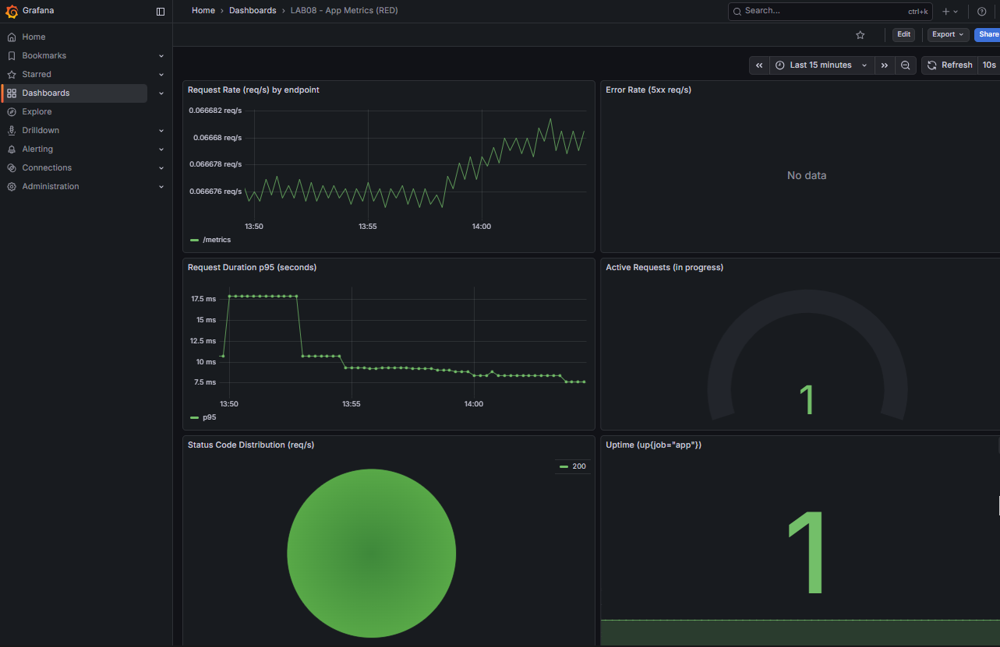

---

## 6. Production Config

- **Resource limits:** All services have `deploy.resources.limits` (Prometheus 1 CPU/1G, etc.)
- **Health checks:** Prometheus `wget /-/healthy`, apps `curl /health`
- **Retention:** Prometheus 15d/10GB, Loki 7d
- **Volumes:** `prometheus-data`, `grafana-data`, `loki-data` for persistence

**Evidence (Task 4):** `docker compose ps` healthy, persistence test.

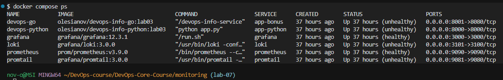

---

## 7. PromQL Examples

- **Request rate (total req/s):** `sum(rate(http_requests_total[5m]))`
- **Request rate by endpoint:** `sum by (endpoint) (rate(http_requests_total[5m]))`
- **Error rate (5xx req/s):** `sum(rate(http_requests_total{status=~"5.."}[5m]))`
- **p95 latency (seconds):** `histogram_quantile(0.95, sum by (le) (rate(http_request_duration_seconds_bucket[5m])))`
- **Active requests (concurrency):** `http_requests_in_progress`
- **App uptime (1=up, 0=down):** `up{job="app"}`

**Evidence:** Screenshots of queries in Grafana Explore.

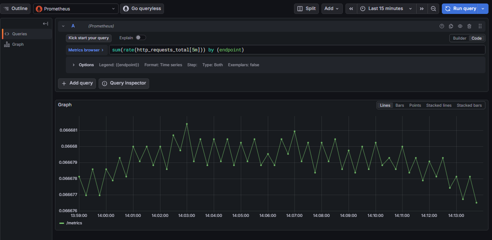
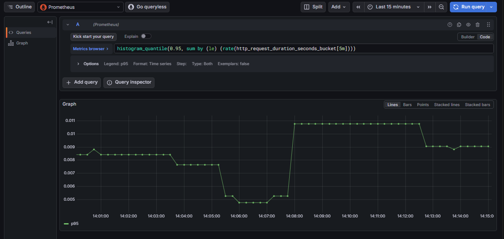
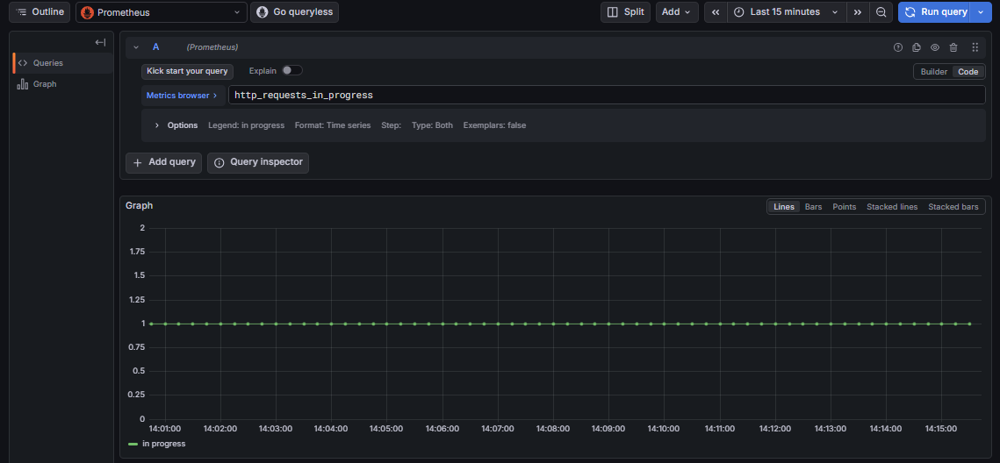
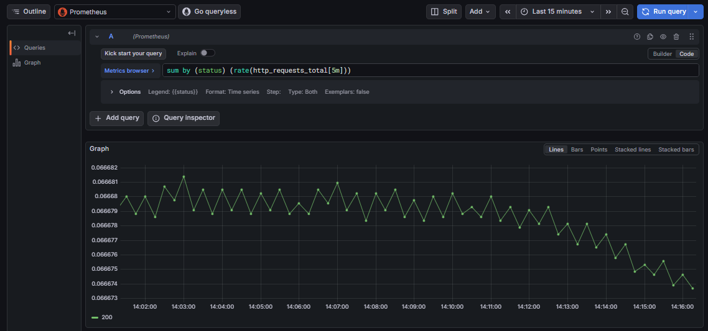
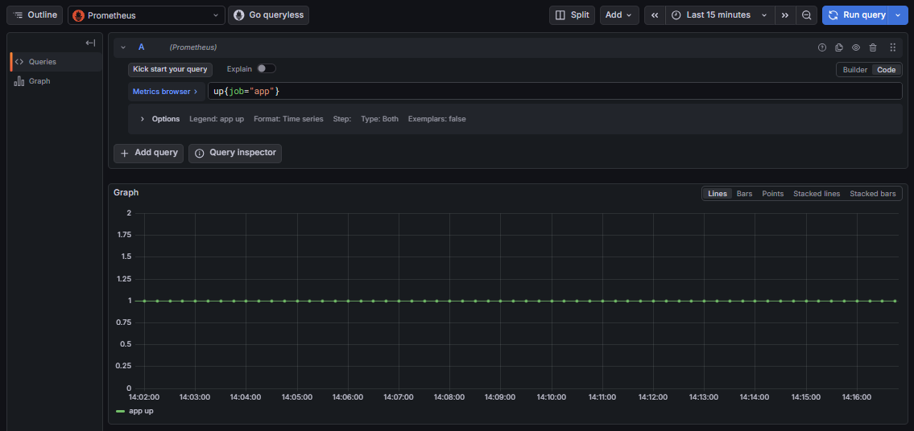
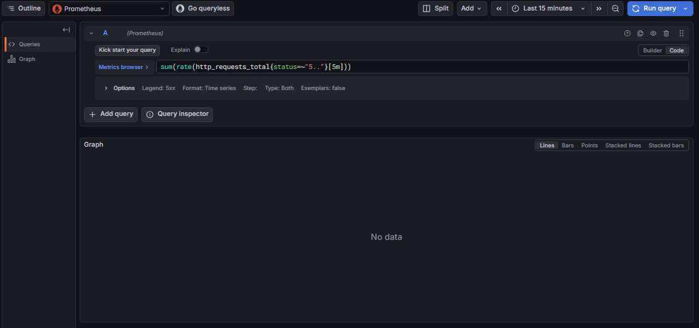

---

## 8. Testing

**RED:** Rate >0, errors=0, duration <1s.

**Evidence:** 
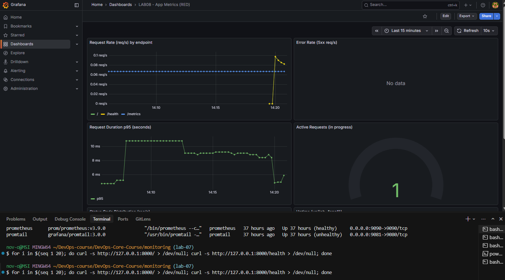


---

## 9. Challenges

- **Prometheus config:** Ensured correct paths and ports for Docker Compose.
- **Metrics naming:** Followed Prometheus best practices.
- **Metrics vs logs:** metrics are for trends/alerting (rate, errors, latency); logs are for debugging and context (request payloads, stack traces).

---

## Bonus — Ansible automation

**Role:** `ansible/roles/monitoring/` extended for Prometheus.

**Variables:** `monitoring_prometheus_*` in `defaults/main.yml` + `monitoring_prometheus_targets`.

**Templates:** `prometheus.yml.j2` with Jinja2 loops for targets.

**Tasks:** templates Prometheus config; provisions Grafana (data sources + dashboards); waits for Prometheus healthy; idempotent API creation for data sources.

**Run WSL:**
```bash
cd DevOps-Core-Course/ansible
ansible-playbook -i inventory/hosts.ini playbooks/deploy-monitoring.yml --ask-vault-pass
```

**Idempotency:** Second run shows changed=0.

**Evidence:**

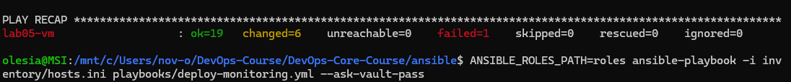
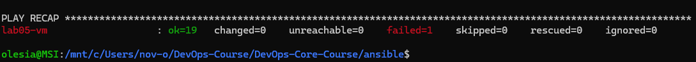

---